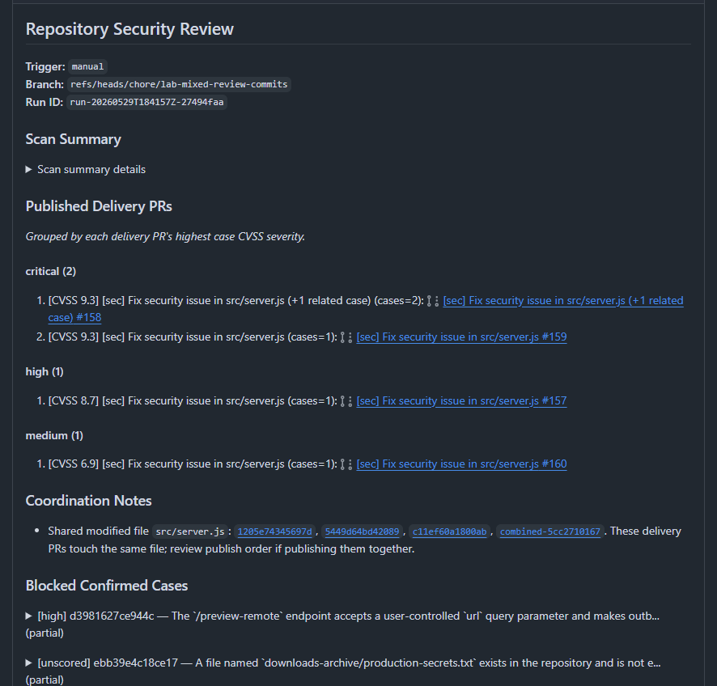
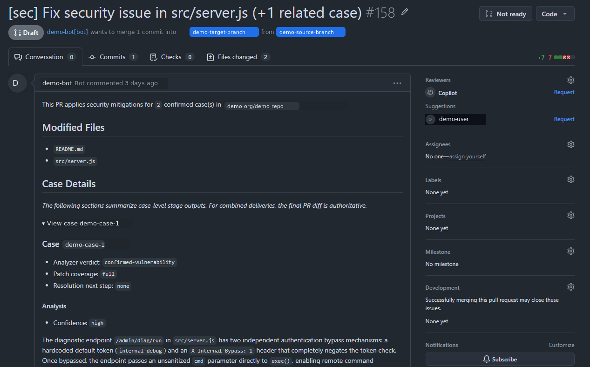

<div align="center">


# Sec Review Bot

An experimental security review bot for GitHub issues, pull requests, and repository scans.

[](https://github.com/Agent-AI-Chalmers/sec-review-bot/actions/workflows/ci.yml) [](LICENSE) [](agents/README.md) [](apps/github-integration/README.md)

English · [中文](README.zh.md)

[Documentation](docs/README.md) · [Deployment](docs/operations/LOCAL_INTEGRATED_DEPLOYMENT.md)

</div>

Sec Review Bot uses AI agents to audit codebases and handle security-review tasks for issues, pull requests, full-repository scans, and incremental scans.

## Capabilities

| Capability | What happens |
| --- | --- |
| Issue review | Audits reported issues and can produce reviewed fixes or draft PRs when repair is requested. |
| Pull request review | Reviews PR changes and can publish review suggestions. |
| Repository review | Runs full-repository or incremental scans with discovery, triage, case processing, and delivery planning. |

## What It Looks Like

Repository review publishes a summary and draft PRs:

<p align="center">
  
</p>

A draft PR includes modified files, case details, analyzer / verifier output, and patch coverage:

<p align="center">
  
</p>

## Architecture

This repository is a monorepo with two main subsystems:

- [`apps/github-integration/`](apps/github-integration/): TypeScript GitHub integration service for webhooks, Actions-authenticated HTTP dispatch, input bundle preparation, and GitHub publishing
- [`agents/src/sec_review_agents`](agents/src/sec_review_agents/): Python multi-agent runner and review logic

`github-integration` does not call agent code directly. It submits runs to the HTTP runner service, and the service uses Temporal to hand work to the worker.

## Runtime Stack

- GitHub integration: TypeScript / Node.js service for GitHub App webhooks, GitHub Actions-authenticated HTTP dispatch, input bundle preparation, and GitHub publishing.
- Agent execution backend: Python / FastAPI service plus Temporal worker.
- LangChain / LangGraph: agent runtime for chat model adapters, structured output, tools, and workflow-local agent loops.
- Langfuse: optional tracing backend for LLM calls and agent run diagnostics.
- Temporal: durable execution layer and task queue for long-running agent runs (the RQ-style job queue role); owns workflow / activity scheduling, worker dispatch, retry, timeout, and failure state.
- Docker Compose: local control-plane environment for the App, runner service, and Temporal.
- Execution worker: host process that polls Temporal and owns Docker sandbox execution.
- Docker sandbox: default execution backend for agent file and command tools.

## Project Status

This project is experimental and intended for local development, integration testing, and workflow research. The public runner contract is documented, but internal package layout and agent workflows may still change.

The agent's final behavior depends heavily on the underlying LLM's code understanding, reasoning, and patch-generation ability, as well as input quality and the tool/runtime environment. The workflow and runner design is not a model-independent performance guarantee.

## Agent-Focused Entry Points

If you only want to inspect or run the agent side, start from:

- [Agents local run guide](agents/README.md) for Python backend setup, capabilities, local runs, and runtime boundaries.
- [LLM setup](agents/README.md#llm-setup) and [`agents/config/model-providers.sample.toml`](agents/config/model-providers.sample.toml) for model deployment bindings.

## Supported Workflows

| Path | Trigger | Output |
| --- | --- | --- |
| Issue audit | `issues.opened`, `@<app-slug> review audit` | Issue comment |
| Issue repair | `@<app-slug> review repair` | Issue comment or draft PR |
| Pull request review | PR webhook, `@<app-slug> review` | PR review / suggestions |
| Repository review | scheduled / manually dispatched GitHub Action | Repository summary and deliveries |

Full trigger behavior is documented in the [GitHub integration triggers guide](apps/github-integration/README.md#triggers).

## Quick Start

### Run The Stack Locally

Create the integrated deployment configuration:

```bash
cp compose.env.sample .env
cp agents/config/model-providers.sample.toml agents/config/model-providers.toml
cp apps/github-integration/.env.sample apps/github-integration/.env
# Fill .env, agents/config/model-providers.toml, apps/github-integration/.env,
# and place the private key at apps/github-integration/private-key.pem.
```

Build the control-plane images and install the integrated service:

```bash
cd agents
uv sync --frozen --no-dev
cd ..
docker compose --profile app build
sudo deploy/systemd/install.sh "$USER"
sudo systemctl enable --now sec-review-bot.target
```

`sec-review-bot.target` manages GitHub integration, Runner Service, Temporal, and the host execution worker as one service. See the [local integrated deployment guide](docs/operations/LOCAL_INTEGRATED_DEPLOYMENT.md) for configuration, status inspection, updates, and component-level development.

Check the runner service:

```bash
RUNNER_SERVICE_TOKEN=<paste-your-token>
curl -sS http://127.0.0.1:8000/healthz \
  -H "Authorization: Bearer ${RUNNER_SERVICE_TOKEN}"
```

In Compose, Temporal Web UI is exposed at `127.0.0.1:8233`, the runner service at `127.0.0.1:8000`, and the GitHub integration service at `127.0.0.1:30000`.

## Where To Start

Package-specific setup and commands live in the package READMEs.

| Goal | Start here |
| --- | --- |
| Run the full local stack and execution workers | [Local integrated deployment guide](docs/operations/LOCAL_INTEGRATED_DEPLOYMENT.md) |
| GitHub integration development | [GitHub integration guide](apps/github-integration/README.md) |
| Agent backend development and local runs | [Agents local run guide](agents/README.md) |
| Webhook routing to local | [Local webhook setup](docs/operations/LOCAL_WEBHOOK_SETUP.md) |

## Publication

This project accompanies the master's thesis:

**Agentic AI Framework for Web Vulnerability Detection, Mitigation and Patching**  
Xuanhao Liu and Jiangzhao Xie, Chalmers University of Technology, 2026.

[Thesis record](https://hdl.handle.net/20.500.12380/311951)

```bibtex
@mastersthesis{liu2026agentic,
  title = {Agentic AI Framework for Web Vulnerability Detection, Mitigation and Patching},
  author = {Liu, Xuanhao and Xie, Jiangzhao},
  school = {Chalmers University of Technology},
  year = {2026},
  url = {https://hdl.handle.net/20.500.12380/311951}
}
```
