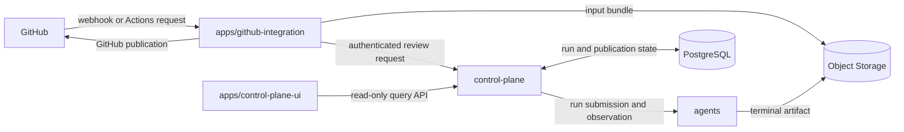

<div align="center">


# Sec Review Bot

An experimental security review bot for GitHub issues, pull requests, and repository scans.

[](https://github.com/Agent-AI-Chalmers/sec-review-bot/actions/workflows/ci.yml) [](LICENSE) [](agents/README.md) [](apps/github-integration/README.md)

English · [中文](README.zh.md)

[Documentation](docs/README.md) · [Deployment](docs/operations/LOCAL_INTEGRATED_DEPLOYMENT.md)

</div>

Sec Review Bot uses AI agents to audit codebases and handle security-review tasks for issues, pull requests, full-repository scans, and incremental scans.

## Capabilities

| Capability          | What happens                                                                                              |
| ------------------- | --------------------------------------------------------------------------------------------------------- |
| Issue review        | Audits reported issues and can produce reviewed fixes or draft PRs when repair is requested.              |
| Pull request review | Reviews PR changes and can publish review suggestions.                                                    |
| Repository review   | Runs full-repository or incremental scans with discovery, triage, case processing, and delivery planning. |

## What It Looks Like

Repository review publishes a summary and draft PRs:

<p align="center">
  
</p>

A draft PR includes modified files, case details, analyzer / verifier output, and patch coverage:

<p align="center">
  
</p>

## Architecture

This repository contains four runtime entities: GitHub integration, Review Control Plane, Control Plane UI, and Agent Runner. They cooperate through authenticated HTTP, shared object storage, and durable PostgreSQL state, while keeping separate responsibilities, configuration, and deployment boundaries.

- [`apps/github-integration/`](apps/github-integration/README.md): TypeScript GitHub integration service for webhooks, Actions-authenticated HTTP dispatch, input bundle preparation, and GitHub publishing
- [`control-plane/`](control-plane/README.md): independently deployed TypeScript service for review-run admission and durable coordination
- [`apps/control-plane-ui/`](apps/control-plane-ui/README.md): independently deployed, read-only web console for inspecting Control Plane runs
- [`agents/`](agents/README.md): Python multi-agent runner and review logic


```mermaid
flowchart LR
  github[GitHub]
  integration[apps/github-integration]
  control[control-plane]
  ui[apps/control-plane-ui]
  agents[agents]
  storage[(Object Storage)]
  state[(PostgreSQL)]

  github -->|webhook or Actions request| integration
  integration -->|authenticated review request| control
  control -->|run submission and observation| agents
  integration -->|input bundle| storage
  agents -->|terminal artifact| storage
  control <-->|run and publication state| state
  ui -->|read-only query API| control
  integration -->|GitHub publication| github
```

## Runtime Stack

- **Languages**: [TypeScript](https://www.typescriptlang.org/) ([Node.js](https://nodejs.org/)) for the integration, Control Plane, and UI server; [Python](https://www.python.org/) 3.14 for the agent backend.
- **Web and UI**: [FastAPI](https://fastapi.tiangolo.com/) serves the agent execution service (Runner) HTTP API; [Vite](https://vitejs.dev/) + [React](https://react.dev/) + [Mantine](https://mantine.dev/) make up the read-only console.
- **Agent runtime**: [LangChain](https://www.langchain.com/) / [LangGraph](https://langchain-ai.github.io/langgraph/) ([deepagents](https://github.com/langchain-ai/deepagents)) for chat-model adapters, structured output, and tool calls.
- **Durable execution**: [Temporal](https://temporal.io/) owns workflow / activity scheduling, worker dispatch, retry, timeout, and failure state.
- **State and storage**: [PostgreSQL](https://www.postgresql.org/) for coordination state; S3-compatible object storage ([RustFS](https://github.com/rustfs/rustfs) locally) for input bundles and diagnostic artifacts.
- **Observability**: [Langfuse](https://langfuse.com/) (optional, external) for LLM-call tracing and run diagnostics.
- **Execution isolation**: [Docker](https://www.docker.com/) sandbox (default) or [bubblewrap](https://github.com/containers/bubblewrap) (bwrap, optional), used by the host execution worker.
- **Local deployment**: [Docker Compose](https://docs.docker.com/compose/) + [systemd](https://systemd.io/).

## Project Status

This project is experimental and intended for local development, integration testing, and workflow research. The public runner contract is documented, but internal package layout and agent workflows may still change.

The agent's final behavior depends heavily on the underlying LLM's code understanding, reasoning, and patch-generation ability, as well as input quality and the tool/runtime environment. The workflow and runner design is not a model-independent performance guarantee.

## Agent-Focused Entry Points

If you only want to inspect or run the agent side, start from:

- [Agents local run guide](agents/README.md) for Python backend setup, capabilities, local runs, and runtime boundaries.
- [LLM setup](agents/README.md#llm-setup) and [`agents/config/model-providers.sample.toml`](agents/config/model-providers.sample.toml) for model deployment bindings.

## Supported Workflows

| Path                | Trigger                                       | Output                            |
| ------------------- | --------------------------------------------- | --------------------------------- |
| Issue audit         | `issues.opened`, `@<app-slug> review audit`   | Issue comment                     |
| Issue repair        | `@<app-slug> review repair`                   | Issue comment or draft PR         |
| Pull request review | PR webhook, `@<app-slug> review`              | PR review / suggestions           |
| Repository review   | scheduled / manually dispatched GitHub Action | Repository summary and deliveries |

Full trigger behavior is documented in the [GitHub integration triggers guide](apps/github-integration/README.md#triggers).

## Quick Start

### Run The Stack Locally

Create the integrated deployment configuration:

```bash
cp compose.env.sample .env
cp agents/config/model-providers.sample.toml agents/config/model-providers.toml
cp apps/github-integration/.env.sample apps/github-integration/.env
cp ops/systemd/deployment.env.sample ops/systemd/deployment.env
# Fill .env, agents/config/model-providers.toml, apps/github-integration/.env,
# and ops/systemd/deployment.env, then place the private key at
# apps/github-integration/private-key.pem.
```

Build all required images and install the integrated service:

```bash
cd agents
uv sync --frozen --no-dev
cd ..
docker compose --profile app build
sudo ops/systemd/install.sh "$USER"
sudo systemctl enable --now sec-review-bot.target
```

`sec-review-bot.target` is the systemd entry point for the complete service. See the [local integrated deployment guide](docs/operations/LOCAL_INTEGRATED_DEPLOYMENT.md) for configuration, status inspection, updates, and component-level development.

## Where To Start

Package-specific setup and commands live in the package READMEs.

| Goal                                           | Start here                                                                          |
| ---------------------------------------------- | ----------------------------------------------------------------------------------- |
| Run the full local stack and execution workers | [Local integrated deployment guide](docs/operations/LOCAL_INTEGRATED_DEPLOYMENT.md) |
| GitHub integration development                 | [GitHub integration guide](apps/github-integration/README.md)                       |
| Agent backend development and local runs       | [Agents local run guide](agents/README.md)                                          |
| GitHub inbound routing to local                | [Local GitHub inbound setup](docs/operations/LOCAL_GITHUB_INBOUND_SETUP.md)         |

## Publication

This project accompanies the master's thesis:

**Agentic AI Framework for Web Vulnerability Detection, Mitigation and Patching**  
Xuanhao Liu and Jiangzhao Xie, Chalmers University of Technology, 2026.

[Thesis record](https://hdl.handle.net/20.500.12380/311951)

```bibtex
@mastersthesis{liu2026agentic,
  title = {Agentic AI Framework for Web Vulnerability Detection, Mitigation and Patching},
  author = {Liu, Xuanhao and Xie, Jiangzhao},
  school = {Chalmers University of Technology},
  year = {2026},
  url = {https://hdl.handle.net/20.500.12380/311951}
}
```
