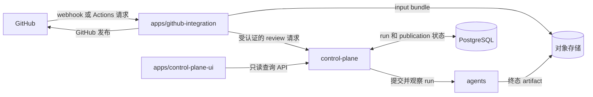

<div align="center">


# Sec Review Bot

一个面向 GitHub issues、pull requests 和仓库级扫描的实验性安全审查 bot。

[](https://github.com/Agent-AI-Chalmers/sec-review-bot/actions/workflows/ci.yml) [](LICENSE) [](agents/README.zh.md) [](apps/github-integration/README.zh.md)

[English](README.md) · 中文

[文档](docs/README.zh.md) · [部署](docs/operations/LOCAL_INTEGRATED_DEPLOYMENT.zh.md)

</div>

Sec Review Bot 支持使用 AI Agent 执行代码库安全审计，覆盖 issue、pull request、全仓扫描和增量扫描等安全审查任务。

## 能力

| 能力                | 行为                                                                 |
| ------------------- | -------------------------------------------------------------------- |
| Issue review        | 审计 issue 报告，并在需要修复时产出经过复核的补丁或 draft PR。       |
| Pull request review | 审查 PR 变更，并可发布 review suggestions。                          |
| Repository review   | 对仓库执行全仓或增量扫描，并进行问题发现、筛选、逐项处理和交付规划。 |

## 运行结果示例

仓库级 review 会发布摘要，并生成对应的 draft PR：

<p align="center">
  
</p>

Draft PR 会包含修改文件、case 详情、analyzer / verifier 输出和补丁覆盖情况：

<p align="center">
  
</p>

## 架构

这个仓库包含四个运行实体：GitHub integration、Review Control Plane、Control Plane UI 和 Agent Runner。它们通过受认证的 HTTP、共享对象存储和持久化 PostgreSQL 状态协作，同时保持各自独立的职责、配置和部署边界。

- [`apps/github-integration/`](apps/github-integration/README.zh.md)：TypeScript 编写的 GitHub integration service，负责 GitHub App webhook、由 GitHub Actions 鉴权的 HTTP dispatch、输入材料准备和 GitHub 发布
- [`control-plane/`](control-plane/README.zh.md)：独立部署的 TypeScript 服务，负责 review run 接纳和持久化协调
- [`apps/control-plane-ui/`](apps/control-plane-ui/README.zh.md)：独立部署、只读的 Control Plane 运维界面
- [`agents/`](agents/README.zh.md)：Python 编写的 multi-agent runner 和审查逻辑



## 运行技术栈

- **语言**：[TypeScript](https://www.typescriptlang.org/)（[Node.js](https://nodejs.org/)）用于集成、Control Plane 和 UI 服务端；[Python](https://www.python.org/) 3.14 用于 agent 后端。
- **Web 与 UI**：[FastAPI](https://fastapi.tiangolo.com/) 提供 agent 执行服务（Runner）的 HTTP API；[Vite](https://vitejs.dev/) + [React](https://react.dev/) + [Mantine](https://mantine.dev/) 构成只读控制台。
- **Agent 运行时**：[LangChain](https://www.langchain.com/) / [LangGraph](https://langchain-ai.github.io/langgraph/)（[deepagents](https://github.com/langchain-ai/deepagents)），负责模型适配、结构化输出和工具调用。
- **持久执行**：[Temporal](https://temporal.io/) 负责 workflow/activity 调度、worker 分发、重试、超时和失败状态。
- **状态与存储**：[PostgreSQL](https://www.postgresql.org/) 存协调状态；S3 兼容对象存储（本地为 [RustFS](https://github.com/rustfs/rustfs)）存输入材料包和诊断产物。
- **可观测性**：[Langfuse](https://langfuse.com/)（可选、外部），用于 LLM 调用追踪和 run 诊断。
- **执行隔离**：[Docker](https://www.docker.com/) sandbox（默认）或 [bubblewrap](https://github.com/containers/bubblewrap)（bwrap，可选），由宿主机执行 worker 使用。
- **本地部署**：[Docker Compose](https://docs.docker.com/compose/) + [systemd](https://systemd.io/)。

## 项目状态

本项目仍处于实验阶段，主要用于本地开发、集成测试和 workflow 研究。Runner 的公开契约有文档约束，但内部 package layout 和 agent workflow 仍可能调整。

Agent 的最终表现很大程度取决于底层 LLM 的代码理解、推理和补丁生成能力，也取决于输入质量和工具 / 运行时环境。本文中的 workflow 设计和运行链路不是独立于模型能力的固定性能保证。

## Agent 入口

如果只想看或运行 agent 侧，可以从这里开始：

- [Agents 本地运行说明](agents/README.zh.md)：Python 运行后端安装、能力、本地运行和运行边界。
- [LLM 配置](agents/README.zh.md#llm-配置) 和 [`agents/config/model-providers.sample.toml`](agents/config/model-providers.sample.toml)：模型 deployment 绑定。

## 支持的工作流

| 路径                | 触发方式                                    | 输出                             |
| ------------------- | ------------------------------------------- | -------------------------------- |
| Issue audit         | `issues.opened`、`@<app-slug> review audit` | issue comment                    |
| Issue repair        | `@<app-slug> review repair`                 | issue comment 或 draft PR        |
| Pull request review | PR webhook、`@<app-slug> review`            | PR review / suggestions          |
| Repository review   | 定时或手动触发的 GitHub Action              | repository summary 和 deliveries |

完整触发行为见 [GitHub integration 触发说明](apps/github-integration/README.zh.md#触发)。

## 快速开始

### 本地启动完整链路

创建集成部署配置：

```bash
cp compose.env.sample .env
cp agents/config/model-providers.sample.toml agents/config/model-providers.toml
cp apps/github-integration/.env.sample apps/github-integration/.env
cp ops/systemd/deployment.env.sample ops/systemd/deployment.env
# 填好 .env、agents/config/model-providers.toml、apps/github-integration/.env 和
# ops/systemd/deployment.env，并把私钥放到 apps/github-integration/private-key.pem
```

构建所有需要的镜像并安装集成服务：

```bash
cd agents
uv sync --frozen --no-dev
cd ..
docker compose --profile app build
sudo ops/systemd/install.sh "$USER"
sudo systemctl enable --now sec-review-bot.target
```

`sec-review-bot.target` 是整套服务的 systemd 入口。配置、状态查看、更新和组件级调试见[本地集成部署说明](docs/operations/LOCAL_INTEGRATED_DEPLOYMENT.zh.md)。

## 从哪里开始

各 package 的安装和开发命令放在对应 package README 里。

| 目标                            | 入口                                                                     |
| ------------------------------- | ------------------------------------------------------------------------ |
| 本地启动完整链路和执行 worker   | [本地集成部署说明](docs/operations/LOCAL_INTEGRATED_DEPLOYMENT.zh.md)    |
| 开发 GitHub integration         | [GitHub integration 说明](apps/github-integration/README.zh.md)          |
| 开发 agent 运行后端或做本地运行 | [Agents 本地运行说明](agents/README.zh.md)                               |
| 把 GitHub 入站请求转发到本地    | [本地 GitHub 入站设置](docs/operations/LOCAL_GITHUB_INBOUND_SETUP.zh.md) |

## 论文

本项目是以下硕士论文的配套代码仓库：

**Agentic AI Framework for Web Vulnerability Detection, Mitigation and Patching**  
Liu Xuanhao 和 Xie Jiangzhao，Chalmers University of Technology，2026。

[论文记录](https://hdl.handle.net/20.500.12380/311951)

```bibtex
@mastersthesis{liu2026agentic,
  title = {Agentic AI Framework for Web Vulnerability Detection, Mitigation and Patching},
  author = {Liu, Xuanhao and Xie, Jiangzhao},
  school = {Chalmers University of Technology},
  year = {2026},
  url = {https://hdl.handle.net/20.500.12380/311951}
}
```
