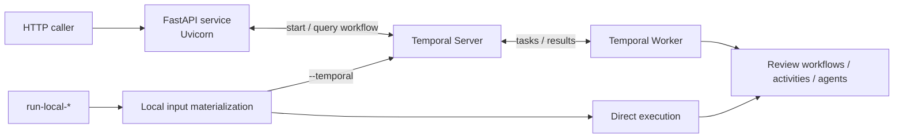

# `sec-review-agents`

Language: English | [中文](README.zh.md)

`agents/` is the Python side of the project. It contains the runner entrypoints, workflow execution, filesystem and workspace runtime, delivery result generation, and observability.

## Setup

From `agents/`:

```bash
uv sync --group dev
source .venv/bin/activate
```

This directory carries its own `.python-version`; `pyproject.toml` requires Python 3.14 or newer.

> *Python 3.14 is the default development, CI, package, and container runtime baseline for this package.*

Development checks:

```bash
uv run ruff check .
uv run black --check .
uv run mypy .
uv run pyright .
uv run python -m pytest
```

For local cleanup, ruff can apply safe mechanical fixes:

```bash
uv run ruff check . --fix
```

## LLM Setup

LLM configuration is deployment-based.

This layer is responsible for:

- reading chat / embedding deployment config through [`llm/config.py`](./src/sec_review_agents/llm/config.py)
- selecting deployments per agent through [`llm/factory.py`](./src/sec_review_agents/llm/factory.py)
- constructing native LangChain chat models by provider prefix:
  - `openai/...` -> `ChatOpenAI`
  - `anthropic/...` -> `ChatAnthropic`
  - `google/...` -> `ChatGoogleGenerativeAI`

When running from this repository, local commands read `agents/.env` and `agents/config/model-providers.toml` by default.

The local `run-local-*` CLIs and `sec-review-agents-check-llm-deployments` load `agents/.env`, but never overwrite environment variables already set in the process.

`sec-review-agents-service` and `sec-review-agents-worker` do not load `.env` by themselves. Pass their environment through the shell, process supervisor, or CI. The integrated Compose deployment configures Runner Service directly and does not read `agents/.env`.

There is no `.env` path override. `MODEL_PROVIDERS_CONFIG_TOML` has the highest priority for model config; set it only when using another TOML location or when the run layout does not preserve the project-relative path.

`[agent_deployment_bindings]` explicitly binds agents to deployments. Every agent that can run must be declared; undeclared agents fail fast and do not inherit a default model.

Each `[[deployments]]` entry must explicitly declare `max_input_tokens`. The runner does not infer context-window size from LangChain model profiles or provider names; this deployment contract is the source of truth for context-limit behavior.

## Capabilities

The Python runner supports:

- `issue-review` workflow
- issue analyzer / mitigator / verifier
- `pull-request-review` workflow
- PR analyzer / mitigator / verifier
- `repository-review` workflow
  - discovery / triage / analyzer / cvss-v4-scoring / mitigator / verifier / delivery
  - delivery organizes repository cases into publishable delivery results; non-delivered cases are still shown through case results
- local evaluation / ablation paths:
  - `issue-review-two-stage`
  - `issue-review-single-agent` (local baseline)

Resources live inside the package:

- [`./src/sec_review_agents/resources/`](./src/sec_review_agents/resources/)
- The runner reads prompts from there, prepares the skills declared for an agent, and mounts them for that agent.

## Layout

The Python package is easiest to read by responsibility:

1. Agent implementations.
   - `agents/`: prompts, runtime setup, tools, and output schemas for each agent.

2. Stage pipeline: shared execution, stage artifacts, and public result contracts.
   - `scan_stages/`: repository discovery / triage stage execution; turns repository scan signals into cases.
   - `review_stages/`: analysis / mitigation / verification / CVSS stage execution, stage result payloads, review record projection, and verifier feedback logic.
   - `delivery_stages/`: repository delivery planning, delivery execution, patch synthesis execution, and delivery result generation.

3. Workflows: combines stages into product paths.
   - `workflows/`: `issue/`, `pull_request/`, and `repository/` are the three public workflows; `repository_case/` is the per-case review used inside repository workflow.

4. Local and operator commands.
   - `cli/`: commands for development and operations that perform one requested task and exit, plus their local-only support code.

5. Production entrypoints.
   - `entrypoints/`: long-lived processes started by the deployment system, including the FastAPI service and Temporal worker, plus their run protocol and workflow input preparation boundaries.

6. Runtime support: infrastructure needed to run agents.
   - `runtime/`, `filesystem/`, `workspace/`, `llm/`, `resources/`, `observability/`: agent runtime, filesystem sandbox, workspace artifacts, model config, prompt / skill resources, and diagnostics.

## Execution Architecture



The FastAPI service receives HTTP run requests and uses the Temporal client to start and query workflows; it does not execute agents. Temporal Server persists workflow state and dispatches tasks to the polling worker. Direct local execution bypasses both the HTTP service and Temporal while reusing activity functions; `run-local-* --temporal` bypasses the HTTP service but uses Temporal Server and the worker.

## Local Runs

Local runs are for development and debugging. They are not the production integration path.

There are three local execution paths:

- Direct local run: the default and fastest path for ordinary development.
- Local `--temporal` run: for exercising workflow / activity orchestration.
- Manually started service and worker: for exercising the complete service path without the full Compose stack.

The two `run-local-*` paths do not participate in memory extraction or maintenance. The manually started service and worker use the production workflow path.

### `run-local-*` Commands

The `run-local-*` commands prepare workspace snapshots, history, and incremental windows through `cli/local_materialization/`, then reuse the production workflow input preparation boundary to derive artifact directories. They use direct local execution by default, without the HTTP service or Temporal.

After installing dependencies, these commands are available:

- `sec-review-agents-run-local-issue`: local issue run entrypoint. Use `--strategy default|two-stage|single-agent` to choose the default multi-stage path, two-stage ablation, or single-agent baseline.
- `sec-review-agents-run-local-pr`: local PR run entrypoint.
- `sec-review-agents-run-local-repository`: local repository scan run entrypoint. Use `--scan-mode full|incremental` to choose full or incremental scan, and repeat `--paths-ignore PATTERN` to ignore paths or globs.

Local runs use a temporary directory by default for the workflow result, workspace snapshot, history, and other artifacts. At the end of the command, the CLI prints `WORKFLOW_RESULT=...`, which you can use to locate the result; you can also use `--output-dir` to override the output directory.

Examples:

```bash
cd /path/to/monorepo
cp agents/.env.sample agents/.env
cp agents/config/model-providers.sample.toml agents/config/model-providers.toml

# 1) issue
# Explicitly choose both the review objective and repair mode.
sec-review-agents-run-local-issue \
  --repo /abs/path/to/repo \
  --issue-md /abs/path/to/issue.md \
  --target-branch main \
  --output-dir /abs/path/to/local-run \
  --review-objective repair \
  --repair-mode test-changes-allowed

# 1b) issue two-stage ablation
sec-review-agents-run-local-issue \
  --repo /abs/path/to/repo \
  --issue-md /abs/path/to/issue.md \
  --target-branch main \
  --strategy two-stage \
  --review-objective audit \
  --repair-mode no-test-changes

# 1c) issue single-agent baseline
sec-review-agents-run-local-issue \
  --repo /abs/path/to/repo \
  --issue-md /abs/path/to/issue.md \
  --target-branch main \
  --strategy single-agent \
  --review-objective repair \
  --repair-mode test-changes-allowed

# 2) pr
# Pull-request objective is fixed to audit, but repair mode is still required.
sec-review-agents-run-local-pr \
  --repo /abs/path/to/repo \
  --pr-md /abs/path/to/pr.md \
  --base-sha <base-commit-sha> \
  --head-sha <head-commit-sha> \
  --repair-mode no-test-changes

# 3) full repo scan
# Repository objective is fixed to audit, but repair mode is still required.
sec-review-agents-run-local-repository \
  --repo /abs/path/to/repo \
  --target-branch main \
  --paths-ignore docs \
  --paths-ignore '**/*.generated.py' \
  --repair-mode test-changes-allowed

# 4) incremental repo scan
sec-review-agents-run-local-repository \
  --repo /abs/path/to/repo \
  --target-branch main \
  --scan-mode incremental \
  --base-sha <base-commit-sha> \
  --head-sha <head-commit-sha> \
  --repair-mode test-changes-allowed # optional head; repair-mode is required
```

### Use Temporal with `run-local-*`

Use `--temporal` only when you specifically want to exercise internal Temporal workflow / activity orchestration.

With `--temporal`, the same local command still prepares input on the developer machine, but the workflow stages run through Temporal workflow / activity scheduling. This is useful when debugging workflow orchestration, retries, activity boundaries, or Temporal-visible state. It still bypasses the HTTP Runner Service, so it is not the same as the full service path.

Before running a `--temporal` local command, start a local Temporal dev server:

```bash
temporal server start-dev --ip 127.0.0.1 --port 7233
```

Then start the runner worker as a host process in another terminal:

```bash
cd agents
cp .env.sample .env
cp config/model-providers.sample.toml config/model-providers.toml
# Fill .env and config/model-providers.toml.

set -a
. .env
set +a

TEMPORAL_ADDRESS=127.0.0.1:7233 \
TEMPORAL_NAMESPACE=default \
TEMPORAL_TASK_QUEUE=sec-review-agents \
sec-review-agents-worker
```

### Run the Service and Worker Manually

To exercise the complete HTTP service, Temporal, and worker path locally, start all three processes in separate terminals.

Minimal local startup shape:

Terminal 1, Temporal Server:

```bash
temporal server start-dev
```

Terminal 2, FastAPI service:

```bash
TEMPORAL_ADDRESS=127.0.0.1:7233 \
TEMPORAL_TASK_QUEUE=sec-review-agents \
sec-review-agents-service
```

Terminal 3, Temporal Worker:

```bash
TEMPORAL_ADDRESS=127.0.0.1:7233 \
TEMPORAL_TASK_QUEUE=sec-review-agents \
sec-review-agents-worker
```

The service owns HTTP, authentication, run request validation, and starting Temporal workflows. The worker polls Temporal for registered workflow and activity tasks and executes them. Model, sandbox, skills, and activity concurrency environment variables belong to the worker runtime.

Docker Compose control-plane startup and host worker operation are documented in the [local integrated deployment guide](../docs/operations/LOCAL_INTEGRATED_DEPLOYMENT.md).

## Agent Runtime Configuration

Agents can declare the skills they need. The runner prepares and mounts the declared skills when it starts an agent. See [Agent Skills](../docs/agent/SKILLS.md) for details.

`AGENT_MEMORY_DIR` points to the agent memory store. Main agents read the store's `memory/` subtree as `/memory`, including `memory/MEMORY.md` as runtime guidance. Set `AGENT_MEMORY_ENABLED=false` to disable memory end to end: main agents stop reading it, and memory extraction and maintenance stop running. Memory content comes from past review transcripts and is extracted, curated, and maintained for reuse in later reviews. See [Agent Memory System](../docs/agent/MEMORY_SYSTEM.md) for the design.

Agents that require structured output check whether the final state contains `structured_response`. If the model only returns plain text and does not produce a structured result, agent middleware appends a correction message inside the LangChain agent loop and retries. Retry count is controlled by `AGENT_MISSING_STRUCTURED_RESPONSE_MAX_RETRIES`, default `2`. This fallback is separate from provider/API request retry and does not handle schema-parameter validation errors; those remain under LangChain structured-output retry behavior.

## Sandbox Runtime

The normal agent runtime prefers Docker sandbox. The local filesystem backend is a fallback for Docker-unavailable situations or when a developer explicitly disables sandboxing.

Default strategy:

- `AGENT_SANDBOX_BACKEND` unset or `auto`: detect Docker automatically; use Docker sandbox when available, otherwise fall back to the local filesystem backend
- `AGENT_SANDBOX_BACKEND=docker`: force Docker sandbox
- `AGENT_SANDBOX_BACKEND=local`: explicitly use the local fallback

Analyzer / mitigator / verifier stages that need to run tests, reproductions, build commands, or optional runtime services should run under Docker sandbox. The local fallback is intentionally limited: it can expose mounted files for bounded reads and configured writes, but it should not be treated as a complete runtime validation environment.

Benchmark and local debug runs can set `runtime.workspace_image` to choose the image for the isolated container that hosts the target repository.

### Optional MCP Tools

See [Agent MCP](../docs/agent/MCP.md) for how MCP fits into this project. This section only lists common optional tools for local runs.

CodeGraph helps the agent with symbol / caller tracing, which is often better than plain grep for cross-file call relationships. For Docker sandbox, build a workspace image with CodeGraph installed, use it as the sandbox image, and enable MCP:

```bash
docker build -f agents/docker/workspace-codegraph.Dockerfile -t sec-review-bot-workspace:codegraph agents
AGENT_DOCKER_IMAGE=sec-review-bot-workspace:codegraph
AGENT_MCP_ENABLED=true
```

The documented CodeGraph path for normal stage execution is Docker sandbox.
