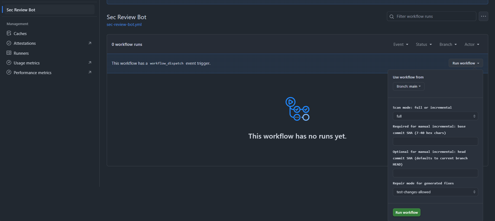

# `@sec-review-bot/github-integration`

语言：[English](README.md) | 中文

本文是 [README.md](README.md) 的中文译文。英文版是权威版本；如果两者不一致，以英文版为准。

这个 package 是项目里的 GitHub integration service。

它不直接执行 agent workflow；它负责准备输入、提交 runner run、轮询结果，并把结果发布回 GitHub。

## 安装

在 `apps/github-integration/` 目录运行：

```bash
corepack enable pnpm
pnpm install
```

请使用 Node 24.x。

> *Node 24 是当前 package 的 LTS 基线。[Node.js release schedule](https://github.com/nodejs/Release#release-schedule) 当前把 Node 26 的 Active LTS start 列为 2026-10-28；到那之后，可以评估把默认 runtime 切到 Node 26。*

## 命令

```bash
pnpm run dev
pnpm run server
pnpm run lint
pnpm run build
```

## Runner Run 诊断

执行过 `pnpm install` 和 `pnpm run build` 后，可以运行：

```bash
sec-review-runner-runs --limit 20
sec-review-runner-runs --active-only
sec-review-runner-runs --failed-only --json
sec-review-runner-runs --status publish_failed
```

该命令读取本地 SQLite runner run store，并输出后台 publisher 状态。重要列：

| 列 | 含义 |
| --- | --- |
| `active` | 后台 publisher 仍会处理该 run。 |
| `terminal` | 该 run 不再需要 publisher 工作。 |
| `retry_exhausted` | run 处于 `publish_failed`，并且没有剩余发布重试次数。 |
| `attempts` | 已记录的 GitHub 发布失败次数；领取 run 准备发布不计数。 |
| `failure_code` | run 中持久化的结构化失败码。 |

如果 runner 输出不符合契约、GitHub 权限不足、目标仓库/Issue/PR 已不存在，或发布请求本身不符合 GitHub 校验，当前 run 会直接进入终态。临时 GitHub 发布失败会保留为 `publish_failed` 并重试，直到 GitHub 发布累计失败三次。排障时再通过 `failure_code` 区分具体原因。

## 本地接收端

完整 review 还需要 runner service 和 worker。要在本地跑完整链路，请使用仓库级 Docker Compose 部署。下面的命令只启动 GitHub integration service。

非 Compose 启动时，先按 `apps/github-integration/.env.sample` 填好 `apps/github-integration/.env`；至少需要设置 `APP_ID`、`PRIVATE_KEY_PATH`、`WEBHOOK_SECRET` 和 `AGENT_RUNNER_SERVICE_URL`。任何非 loopback runner service URL，或 runner service 要求 token 时，都需要设置 `AGENT_RUNNER_SERVICE_TOKEN`。

```bash
pnpm run server
```

开发态：

```bash
pnpm run dev
```

本地 URL：

```text
http://localhost:30000/api/webhook
http://localhost:30000/api/repository-review/dispatch
```

如果本地没有公网 HTTPS 地址，可以用 `smee`，如：

```bash
npx smee -u https://smee.io/your-channel -t http://localhost:30000/api/webhook
```

GitHub 参考：

- GitHub App quickstart:
  - <https://docs.github.com/en/apps/creating-github-apps/writing-code-for-a-github-app/quickstart>
- GitHub webhook app guide:
  - <https://docs.github.com/en/apps/creating-github-apps/writing-code-for-a-github-app/building-a-github-app-that-responds-to-webhook-events>

如果你已经有域名，也可以用 Cloudflare Tunnel 把公网地址转到本地服务。

更多 webhook / GitHub App 本地开发说明见 [本地 webhook 设置](../../docs/operations/LOCAL_WEBHOOK_SETUP.zh.md)。

## 职责

- 读取 GitHub App 元信息与 installation 身份

- 接收 GitHub webhook
- 接收 GitHub Actions 发起、通过 OIDC 鉴权的 HTTP dispatch

- 准备 issue / pull request review input
- 准备 repository review input

- 调用 HTTP Agent Runner Service
- 把结构化结果发布回 GitHub

## 目录

- `reviews/` - 各类 review workflow 的输入准备、提交、发布与渲染
  - `reviews/issues/` - issue review
  - `reviews/pull-requests/` - PR review、建议评论
  - `reviews/repositories/` - repository review、摘要 issue 与修复 draft PR
- `infrastructure/runner/` - HTTP runner client、runner input 类型、input bundle manifest / workspace helper、SQLite run state、后台 publisher
- `infrastructure/github/` - GitHub API 薄封装和 webhook 辅助函数
- `interfaces/` - HTTP、GitHub Actions 和 GitHub webhook adapter
- `triggers/` - 把 webhook / Actions / comment 请求转换为 runner review run
- `utils/` - 轻量日志与辅助函数

## 触发

### 配置自动触发

触发模式配置在目标仓库的 [`.github/sec-review-bot.yml`](../../.github/sec-review-bot.yml)。

配置格式：

```yaml
sec_review_bot:
  # 控制 PR / issue webhook 自动触发。
  #
  # - manual_only: 不响应自动 PR / issue 事件；
  #   只有仓库 write+ 用户的显式 comment 命令会触发 review。
  # - automatic: 危险模式。任意作者的 PR / issue 事件都会自动触发 review，
  #   无需维护者确认，并可能消耗 runner / LLM 资源。
  trigger_mode: manual_only

  # 可选：repository discovery 阶段忽略路径（glob）
  # 行为参考 CodeQL 的 paths-ignore
  paths_ignore:
    - 'frontend/src/assets'
    - '**/*.min.js'
    - 'node_modules'
```

配置含义如下：

- `trigger_mode: manual_only`：自动对象事件会被接收后跳过，只有仓库 `write`、`maintain` 或 `admin` 用户在 comment 中显式写出对应手动命令才会触发 workflow。
- `trigger_mode: automatic`：危险模式。`pull_request.opened`、`pull_request.ready_for_review`、`issues.opened` 等事件会为任意作者触发 workflow，包括没有仓库写权限的用户。它无需维护者确认就可能消耗 runner / LLM 资源。

说明：

- [`.github/workflows/sec-review-bot.yml`](../../.github/workflows/sec-review-bot.yml) 仅用于 GitHub Actions 调度，不再承载 bot 的运行配置。
- 如果 [`.github/sec-review-bot.yml`](../../.github/sec-review-bot.yml) 文件不存在，默认行为是 `trigger_mode: manual_only`。
- 如果配置文件存在但 YAML 非法、缺少 `sec_review_bot.trigger_mode` 或值不在允许集合内，自动 webhook 会严格报错并失败（不会静默降级）。
- `paths_ignore` 仅影响 repository-review 的 discovery 文件扫描；不影响 PR/Issue webhook 触发判定本身。
- 仓库配置不支持选择 workspace image。GitHub App 不会从 `.github/sec-review-bot.yml` 解析 image 配置字段。

### 手动命令

这里的 `<app-slug>` 不是字面量占位符，而是这只 GitHub App 在 GitHub 上注册的实际 slug。假设 app slug 是 `web-sec-bot`，那么 comment 里的实际写法就是 `@web-sec-bot review repair`。

普通 issue comment 支持：

```text
@<app-slug> review audit
@<app-slug> review repair
@<app-slug> review repair no-test-changes
```

普通 issue 上单独写 `@<app-slug> review` 不会触发 workflow，因为系统无法判断你想先审计输入，还是直接按修复意图推进。

issue comment 支持三种模式：

- `review audit`：先审计 issue 输入是否对应当前仓库里的可修复安全问题；只有确认可修复目标后才进入修复阶段。
- `review repair`：用户已经表达修复意图；workflow 在 analyzer 后进入修复阶段，尝试生成 patch；如果修复不适用或覆盖不足，结果会明确说明原因。默认允许最终 patch 包含合理的测试改动。
- `review repair no-test-changes`：同样表达修复意图，但最终 patch 不应包含测试改动；测试只能作为临时验证手段。

自动 issue 触发使用 `audit`，因为自动触发时还没有人明确做出“请修”的决断。

PR Conversation comment 支持：

```text
@<app-slug> review
@<app-slug> review no-test-changes
```

PR 命令含义：

- `review`：触发 PR review，默认允许最终 patch 包含合理的测试改动。
- `review no-test-changes`：同样触发 PR review，但最终 patch 不应包含测试改动；测试只能作为临时验证手段。

### 仓库级 Actions 触发

仓库级 review 通过 [`.github/workflows/sec-review-bot.yml`](../../.github/workflows/sec-review-bot.yml) 的 `workflow_dispatch` 或 `schedule` 触发，不使用 comment 命令。



目标仓库必须配置这些 Actions secrets：

- `SEC_BOT_DISPATCH_URL`：App dispatch endpoint 的完整公网 HTTPS URL，例如 `https://your-bot-dev.example.com/api/repository-review/dispatch`

Repository-level dispatch 使用 GitHub Actions OIDC。workflow 必须授予 `id-token: write`，token audience 固定为 `sec-review-bot`。

手动 `workflow_dispatch` 支持：

- `scan_mode`：`full` 或 `incremental`
- `base_sha`：手动增量扫描必填
- `head_sha`：手动增量扫描可选，默认当前分支 HEAD
- `repair_mode`：`test-changes-allowed` 或 `no-test-changes`

`repair_mode=no-test-changes` 表示仓库级扫描生成的最终 patch 不应包含测试改动；测试仍可作为临时验证手段。`schedule` 触发不带手动 input 时使用默认修复模式。

`schedule` 触发默认按 incremental scan 处理，并由 App 侧根据 cron 推导扫描窗口；手动 incremental 必须显式提供 `base_sha`。

补充说明：

- comment 手动命令目前只支持普通 issue comment 和 pull request 页面 Conversation 标签下的 comment
- 暂不支持：Files changed 页面里的评论和 Submit review 时提交的 review 评论。

## 后台 Publisher 生命周期

后台 publisher 把 runner 轮询和 GitHub 发布放在 webhook 请求路径之外执行。

| 持久化 run 状态 | 含义 | Publisher 行为 |
| --- | --- | --- |
| `queued` | Runner run 已提交，但尚未观察到运行中状态。 | 继续轮询 runner service。 |
| `running` | Runner service 报告 run 仍在执行。 | 继续轮询。 |
| `publishing` | 某个 publisher 已领取完成的 run，准备执行 GitHub side effects。 | 除非领取已过期，否则其他 publisher 不应再次领取。 |
| `published` | GitHub 发布完成。 | 终态。 |
| `failed` | Runner service 失败，或已持久化的完成结果格式错误且结果确定不可通过重试修复。 | 终态。 |
| `publish_failed` | Runner 已返回完成且结果有效，但调用 GitHub 发布结果失败。 | 最多重试到 GitHub 发布失败三次。 |

Publisher 会重试 `publish_failed` run，直到调用 GitHub 发布结果累计失败三次。领取一个完成的 run 准备发布不算一次尝试；只有真正发布失败才计数。

> 当前重试策略很简单：后台 publisher 启动时会立刻轮询一次，之后按 `AGENT_RUNNER_BACKGROUND_POLL_INTERVAL_MS` 间隔轮询，默认 15 秒。这里还没有指数退避调度。

## GitHub REST API 版本

- 默认通过 `X-GitHub-Api-Version` 固定到 `2026-03-10`，避免落到即将移除的旧兼容路径。
- 可通过环境变量 `GITHUB_API_VERSION` 覆盖（例如在排查或灰度升级时）。
- 版本说明文档：<https://docs.github.com/en/rest/about-the-rest-api/api-versions?apiVersion=2026-03-10>

## Bot 自身事件与发布边界

Bot 自己创建的 comment、PR 或 push 可能会再次触发 webhook，形成自循环。系统在 webhook 入口检查 sender 是否为 Bot，命中后直接跳过，只跳过本 App 自己发出的回流事件。

手动 comment 命令解析也会忽略 Markdown blockquote 行，所以在回复里引用旧 bot 命令不会再次触发；新的命令必须写在引用文本之外。

发布阶段也有一个相关边界：如果 PR 作者是当前 App bot，App 会发布普通 review comment，而不是给自己的 PR 创建 `APPROVE` 或 `REQUEST_CHANGES` reviewer state。如果 GitHub 仍然以 own-PR review 拒绝 approval，publisher 会降级为普通 review comment。
