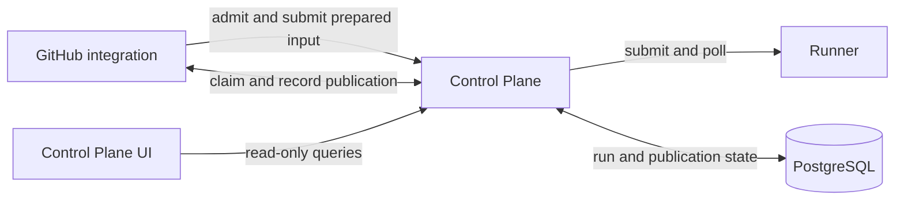
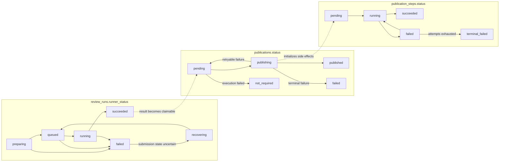

# Control Plane

[中文版](README.zh.md)

Control Plane gives every admitted review a stable identity and durable coordination state. It sits between GitHub integration and Runner so that preparation, submission, execution observation, recovery, and GitHub publication can continue across process restarts and uncertain network outcomes.

## Where it fits



GitHub integration owns GitHub request parsing, input preparation, and GitHub side effects. Runner, Temporal, and the worker own workflow execution. Control Plane coordinates those boundaries without parsing raw GitHub payloads, interpreting workflow-specific results, or executing agents. See the [system architecture](../docs/architecture/SYSTEM_ARCHITECTURE.md) for the complete data flow.

The service runs as an independent Node.js process on port `8090` by default. PostgreSQL credentials are provided only to Control Plane.

## What it does

- Admits a validated request and assigns its `run_id` before input preparation begins.
- Deduplicates replayed GitHub webhook and Actions ingress identities.
- Persists prepared Runner input before submitting it, so an uncertain submission can be recovered.
- Polls Runner and records execution progress, terminal workflow results, and terminal artifact references.
- Makes successful terminal results claimable by the owning integration for GitHub publication.
- Persists publication steps so completed remote side effects are not repeated after restart.
- Exposes redacted, read-only run queries for the Control Plane UI.

## Run lifecycle

A run begins in `preparing` immediately after admission. GitHub integration prepares and uploads the input bundle, then submits the replayable Runner input under the preparation claim. Control Plane records the input and moves the run to `queued` only after Runner accepts it.

Control Plane polls `queued` and `running` runs. A successful Runner result is stored as `succeeded` and becomes eligible for publication. The integration claims that work, performs the GitHub side effects, and records either `published`, a retryable publication failure, or a terminal publication failure.

If Runner submission may have succeeded but its response was lost, the run enters recovery instead of creating a second identity. A terminal preparation or Runner failure makes publication `not_required`.

## Persistence model

Execution and publication are separate state machines:

| Table               | Responsibility                                            | Status                                                                |
| ------------------- | --------------------------------------------------------- | --------------------------------------------------------------------- |
| `review_runs`       | Admission, Runner observation, and terminal workflow data | `preparing`, `recovering`, `queued`, `running`, `succeeded`, `failed` |
| `publications`      | Whole-publication ownership and outcome                   | `pending`, `publishing`, `published`, `failed`, `not_required`        |
| `publication_steps` | Recoverable individual connector side effects             | `pending`, `running`, `succeeded`, `failed`, `terminal_failed`        |



`ReviewRunStatus` is a read projection rather than a database column. It shows Runner status while publication is `pending` or `not_required`, then shows `publishing`, `published`, or publication `failed`. Publication-step status is queried separately.

## Claims and recovery

Preparation, submission recovery, publication, and publication-step commits use claim tokens to fence stale owners. A timed-out owner may finish an external request, but it cannot commit state after another owner acquires a new token.

`run_id` is globally unique in PostgreSQL. `ingress_kind` and `ingress_key` provide connector-scoped ingress idempotency. `connector_id` fences reads, claims, publications, and publication steps. Durable-operation logs include both `connector_id` and `run_id`.

Temporal history, PostgreSQL coordination state, and object-storage artifacts are independent recovery inputs. A missing Runner run does not imply publication success, and a remote side effect is complete only after its publication step records success.

## HTTP API

| Endpoint                                 | Authentication                | Purpose                                                              |
| ---------------------------------------- | ----------------------------- | -------------------------------------------------------------------- |
| `GET /healthz`                           | None                          | Process health                                                       |
| `POST /v1/store`                         | `CONTROL_PLANE_SERVICE_TOKEN` | Internal admission, submission, recovery, and publication operations |
| `GET /v1/runs?...`                       | `CONTROL_PLANE_READ_TOKEN`    | Filtered, cursor-paginated run list                                  |
| `GET /v1/runs/:run_id`                   | `CONTROL_PLANE_READ_TOKEN`    | Redacted run detail                                                  |
| `GET /v1/runs/:run_id/publication-steps` | `CONTROL_PLANE_READ_TOKEN`    | Publication-step summary                                             |

Read responses omit `runner_input` and `publish_context`. The UI BFF holds the read token; browser code receives neither Control Plane token.

## Configuration

| Variable                                   | Required                             | Purpose                                              |
| ------------------------------------------ | ------------------------------------ | ---------------------------------------------------- |
| `DATABASE_URL`                             | Yes                                  | PostgreSQL connection string                         |
| `CONTROL_PLANE_SERVICE_TOKEN`              | Yes                                  | Internal mutation and coordination authentication    |
| `CONTROL_PLANE_READ_TOKEN`                 | Yes                                  | Read-only query authentication                       |
| `AGENT_RUNNER_SERVICE_URL`                 | Yes                                  | Runner service base URL                              |
| `AGENT_RUNNER_SERVICE_TOKEN`               | For non-loopback or protected Runner | Runner authentication                                |
| `CONTROL_PLANE_PORT`                       | No                                   | Listen port; default `8090`                          |
| `CONNECTOR_ID`                             | No                                   | Coordination namespace; default `github-app:default` |
| `AGENT_RUNNER_BACKGROUND_POLL_INTERVAL_MS` | No                                   | Coordinator interval; default `15000`                |
| `AGENT_RUNNER_SERVICE_REQUEST_TIMEOUT_MS`  | No                                   | Runner request timeout; default `30000`              |
| `AGENT_RUNNER_SERVICE_REQUEST_RETRIES`     | No                                   | Runner transport retries; default `2`                |
| `AGENT_RUNNER_SERVICE_RETRY_BASE_DELAY_MS` | No                                   | Initial retry delay; default `500`                   |

## Database schema

Schema files live in `src/database/schema-versions`. Applied versions and SHA-256 checksums are recorded in `schema_versions`. Startup uses a PostgreSQL advisory lock to serialize schema work and rejects a database whose recorded checksum differs from the checked-in file. The experimental deployment policy permits destructive schema resets.

## Development

Use Node.js 24 and pnpm 12. Install dependencies and start the service from this directory:

```bash
pnpm install --frozen-lockfile
pnpm run server
```

Checks:

```bash
pnpm run format:check
pnpm run lint
pnpm run typecheck
pnpm test
pnpm run test:integration
```

`pnpm run test:integration` requires `TEST_DATABASE_URL` or `DATABASE_URL` pointing to a disposable PostgreSQL database.
