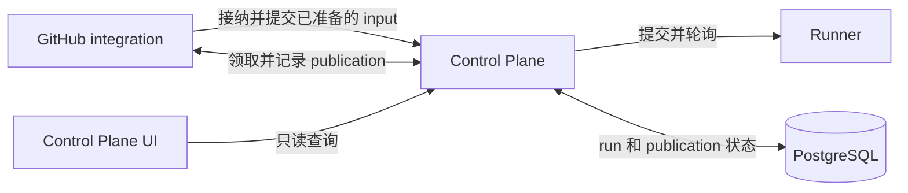
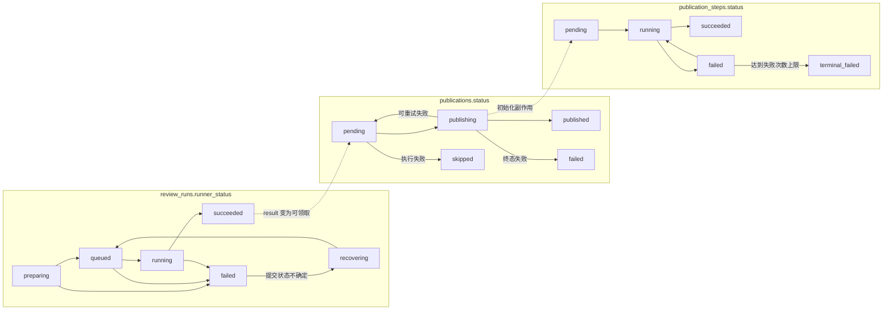

# Control Plane

[English](README.md) | 中文

Control Plane 为每个已接纳的 review 提供稳定身份和持久化协调状态。它位于 GitHub integration 与 Runner 之间，使 input 准备、Runner 提交、执行观察、故障恢复和 GitHub 发布能够跨进程重启和不确定的网络结果继续进行。

## 在系统中的位置



GitHub integration 负责解析 GitHub 请求、准备 input 和执行 GitHub 副作用。Runner、Temporal 和 worker 负责 workflow 执行。Control Plane 协调这些边界，但不解析原始 GitHub payload、不解释 workflow 专用 result，也不执行 agent。完整数据流见[系统架构](../docs/architecture/SYSTEM_ARCHITECTURE.zh.md)。

服务作为独立 Node.js 进程运行，默认监听 `8090`。PostgreSQL 凭据只提供给 Control Plane。

## 功能

- 在 input 准备开始前接纳已校验请求并分配 `run_id`。
- 对重复送达的 GitHub webhook 和 Actions 入口身份进行去重。
- 在提交 Runner 前持久化已准备的 Runner input，使状态不确定的提交可以恢复。
- 轮询 Runner，并记录执行进度、终态 workflow result 和终态 artifact 引用。
- 让所属 integration 可以领取成功终态并执行 GitHub 发布。
- 持久化 publication step，避免进程重启后重复已完成的远程副作用。
- 为 Control Plane UI 提供脱敏的只读 run 查询。

## Run 生命周期

Run 在接纳后立即进入 `preparing`。GitHub integration 准备并上传 input bundle，再使用 preparation claim 提交可重放的 Runner input。Control Plane 记录 input，并且只在 Runner 接受请求后将 run 转为 `queued`。

Control Plane 轮询 `queued` 和 `running` run。Runner 成功后，Control Plane 将结果保存为 `succeeded`，使其可以被领取并发布。Integration 领取该工作，执行 GitHub 副作用，再记录 `published`、可重试的 publication 失败或终态 publication 失败。

如果 Runner submission 可能成功但响应丢失，run 会进入 recovery，而不是创建第二个身份。Preparation 或 Runner 的终态失败会将 publication 标为 `skipped`。

## 持久化模型

执行和发布是两个分开的状态机：

| 表                  | 职责                                  | 状态                                                                  |
| ------------------- | ------------------------------------- | --------------------------------------------------------------------- |
| `review_runs`       | 接纳、Runner 观察和终态 workflow 数据 | `preparing`、`recovering`、`queued`、`running`、`succeeded`、`failed` |
| `publications`      | 整体发布的所有权和结果                | `pending`、`publishing`、`published`、`failed`、`skipped`             |
| `publication_steps` | 可恢复的单个 connector 副作用         | `pending`、`running`、`succeeded`、`failed`、`terminal_failed`        |



`ReviewRunStatus` 是读取投影，不是数据库字段。Publication 为 `pending` 或 `skipped` 时，它显示 Runner 状态；之后显示 `publishing`、`published` 或 publication `failed`。Publication step 状态需要单独查询。

`publication_steps.failure_count` 只记录失败的执行。成功执行不会增加该值；失败步骤达到配置的失败次数上限后进入 `terminal_failed`。

## Claim 和恢复

Preparation、submission recovery、publication 和 publication step 提交使用 claim token 隔离过期 owner。Input preparation 活跃期间，GitHub integration 会续租 preparation claim；只有真正被遗弃的 preparation 才会在 claim timeout 后过期。超时 owner 可以完成已发出的外部请求，但在新 owner 获得 token 后不能再提交状态。

`run_id` 在 PostgreSQL 中全局唯一。`ingress_kind` 和 `ingress_key` 提供 connector 范围的入口幂等。`connector_id` 隔离读取、claim、publication 和 publication step。持久化操作日志同时包含 `connector_id` 和 `run_id`。

Temporal history、PostgreSQL 协调状态和对象存储 artifact 是彼此独立的恢复输入。Runner run 缺失不表示 publication 成功；远程副作用只有在 publication step 记录成功后才算完成。

## HTTP API

| Endpoint                                 | 认证                          | 用途                                    |
| ---------------------------------------- | ----------------------------- | --------------------------------------- |
| `GET /healthz`                           | 无                            | 进程健康检查                            |
| `POST /v1/store`                         | `CONTROL_PLANE_SERVICE_TOKEN` | 内部接纳、提交、恢复和 publication 操作 |
| `GET /v1/runs?...`                       | `CONTROL_PLANE_READ_TOKEN`    | 支持过滤和 cursor 分页的 run 列表       |
| `GET /v1/runs/:run_id`                   | `CONTROL_PLANE_READ_TOKEN`    | 脱敏的 run 详情                         |
| `GET /v1/runs/:run_id/publication-steps` | `CONTROL_PLANE_READ_TOKEN`    | Publication step 摘要                   |

只读响应不包含 `runner_input` 和 `publish_context`。UI BFF 持有 read token；浏览器代码不接收任何 Control Plane token。

只读响应报告两个状态轴（`execution_status`、`publication_status`），而不是扁平的 `ReviewRunStatus`，筛选参数同名；`schema/observed-run.schema.json` 是它们的契约。扁平状态只出现在通过 `POST /v1/store` 交换的记录上。

## 配置

| 变量                                       | 是否必需                           | 用途                                      |
| ------------------------------------------ | ---------------------------------- | ----------------------------------------- |
| `DATABASE_URL`                             | 是                                 | PostgreSQL connection string              |
| `CONTROL_PLANE_SERVICE_TOKEN`              | 是                                 | 内部 mutation 和协调认证                  |
| `CONTROL_PLANE_READ_TOKEN`                 | 是                                 | 只读查询认证                              |
| `AGENT_RUNNER_SERVICE_URL`                 | 是                                 | Runner service base URL                   |
| `AGENT_RUNNER_SERVICE_TOKEN`               | 非 loopback 或受保护的 Runner 必需 | Runner 认证                               |
| `CONTROL_PLANE_PORT`                       | 否                                 | 监听端口；默认 `8090`                     |
| `CONNECTOR_ID`                             | 否                                 | 协调 namespace；默认 `github-app:default` |
| `AGENT_RUNNER_BACKGROUND_POLL_INTERVAL_MS` | 否                                 | Coordinator 间隔；默认 `15000`            |
| `AGENT_RUNNER_SERVICE_REQUEST_TIMEOUT_MS`  | 否                                 | Runner 请求超时；默认 `30000`             |
| `AGENT_RUNNER_SERVICE_REQUEST_RETRIES`     | 否                                 | Runner transport 重试次数；默认 `2`       |
| `AGENT_RUNNER_SERVICE_RETRY_BASE_DELAY_MS` | 否                                 | 初始重试延迟；默认 `500`                  |

## 数据库 schema

Schema 文件位于 `src/database/schema-versions`。已执行版本及 SHA-256 checksum 记录在 `schema_versions`。启动时使用 PostgreSQL advisory lock 串行执行 schema，并在数据库记录的 checksum 与当前文件不一致时拒绝启动。实验部署策略允许破坏性 schema reset。

## 开发

使用 Node.js 24 和 pnpm 12。在本目录安装依赖并启动服务：

```bash
pnpm install --frozen-lockfile
pnpm run server
```

检查命令：

```bash
pnpm run format:check
pnpm run lint
pnpm run typecheck
pnpm test
pnpm run test:integration
```

`pnpm run test:integration` 需要 `TEST_DATABASE_URL` 或 `DATABASE_URL` 指向可清空的 PostgreSQL 数据库。
