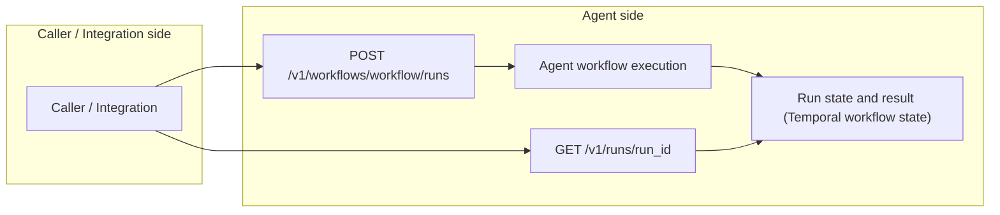

# Docs

Language: English | [中文](README.zh.md)

This directory collects the project docs for `sec-review-bot`: agent design notes, public contracts, workflow design notes, and local operation guides.

For a project overview, start with the repository [README](../README.md).

## Documentation Map

### agent/

Use these docs when you need agent boundaries, capabilities, or framework decisions.

- [CAPABILITY_BOUNDARIES.md](agent/CAPABILITY_BOUNDARIES.md): Agent capability boundaries, including git-history and external-state limits.
- [SKILLS.md](agent/SKILLS.md): Agent skills selection, preparation, and mounting.
- [FRAMEWORK_SELECTION.md](agent/FRAMEWORK_SELECTION.md): Agent framework selection.
- [MEMORY_SYSTEM.md](agent/MEMORY_SYSTEM.md): Agent experience memory extraction and maintenance.
- [MCP.md](agent/MCP.md): Agent MCP tool boundary and runtime placement.
- [RELATED_ISSUES.md](agent/RELATED_ISSUES.md): Agent-related design issues.

### contracts/

Use these docs for the contracts between the App side and agent side:

- [Contracts README](../contracts/README.md): Public integration interface and contract entry point.
- [RUNNER_HTTP_API.md](../contracts/RUNNER_HTTP_API.md): The Agent Runner HTTP API.
- [CONTRACT_V4.md](../contracts/CONTRACT_V4.md): Workflow result contract.

### workflows/

The main public workflow IDs are `issue-review`, `pull-request-review`, and `repository-review`. Issue and PR reviews run analysis, mitigation, and verification; repository review adds discovery, triage, CVSS scoring, and delivery planning.

#### Shared Review Rules

- [CONCURRENCY_MODEL.md](workflows/CONCURRENCY_MODEL.md): Workflow concurrency model.
- [NARRATIVE_FIRST_REVIEW.md](workflows/NARRATIVE_FIRST_REVIEW.md): Narrative-first analyzer output discipline.
- [REVIEW_INTENT.md](workflows/REVIEW_INTENT.md): Review intent and repair-stage constraints.
- [BOUNDED_VERIFIER_FEEDBACK_RETRY.md](workflows/BOUNDED_VERIFIER_FEEDBACK_RETRY.md): Bounded verifier feedback retry.

#### issue-review

- [INPUT_PREANALYSIS.md](workflows/issue-review/INPUT_PREANALYSIS.md): Issue input pre-analysis.

#### pull-request-review

- [SUGGESTION_COMMENT_DESIGN.md](workflows/pull-request-review/SUGGESTION_COMMENT_DESIGN.md): PR suggestion comment mapping rules.

#### repository-review

- [REPOSITORY_REVIEW_STRATEGY.md](workflows/repository-review/REPOSITORY_REVIEW_STRATEGY.md): Repository review strategy and delivery boundaries.
- [REPOSITORY_INCREMENTAL_REVIEW_STRATEGY.md](workflows/repository-review/REPOSITORY_INCREMENTAL_REVIEW_STRATEGY.md): Incremental review strategy.
- [TRIAGE_BOUNDARIES.md](workflows/repository-review/TRIAGE_BOUNDARIES.md): Triage boundaries.
- [AGENT_PARTITION_WORKBENCH.md](workflows/repository-review/AGENT_PARTITION_WORKBENCH.md): Agent-edited partition workbench.
- [CVSSV4.md](workflows/repository-review/CVSSV4.md): CVSS v4 scoring.
- [CONCURRENCY_AND_FAILURES.md](workflows/repository-review/CONCURRENCY_AND_FAILURES.md): Repository review concurrency and failure boundaries.

### operations/

Use these docs when running the system locally or wiring GitHub webhooks:

- [DEPENDENCY_MAINTENANCE.md](operations/DEPENDENCY_MAINTENANCE.md): Dependency update policy, local inspection commands, and verification.
- [DOCKER_COMPOSE_DEPLOYMENT.md](operations/DOCKER_COMPOSE_DEPLOYMENT.md): Full local Docker Compose deployment.
- [LOCAL_WEBHOOK_SETUP.md](operations/LOCAL_WEBHOOK_SETUP.md): Local webhook setup for GitHub App development.

### roadmap/

- [FUTURE_WORK.md](roadmap/FUTURE_WORK.md): Future work.
