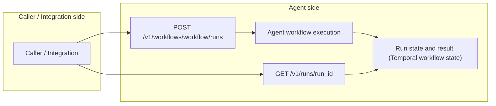

# 文档

语言：[English](README.md) | 中文

这里是 `sec-review-bot` 的项目文档入口，包含 agent 设计说明、public contracts、workflow 设计说明和本地运行指南。

如果想先看项目概览，从仓库根目录的 [README](../README.zh.md) 开始。

## 文档地图

### agent/

需要理解 agent 边界、能力或 framework 取舍时，看这里。

- [CAPABILITY_BOUNDARIES.md](agent/CAPABILITY_BOUNDARIES.md) / [中文](agent/CAPABILITY_BOUNDARIES.zh.md)：Agent 能力边界，包括 git history 和外部状态限制。
- [SKILLS.md](agent/SKILLS.md) / [中文](agent/SKILLS.zh.md)：Agent skills 的选择、准备和挂载。
- [FRAMEWORK_SELECTION.md](agent/FRAMEWORK_SELECTION.md) / [中文](agent/FRAMEWORK_SELECTION.zh.md)：Agent framework 的选型。
- [MEMORY_SYSTEM.md](agent/MEMORY_SYSTEM.md) / [中文](agent/MEMORY_SYSTEM.zh.md)：Agent memory system、经验提取和整理。
- [MCP.md](agent/MCP.md) / [中文](agent/MCP.zh.md)：Agent MCP 工具边界和运行位置。
- [RELATED_ISSUES.md](agent/RELATED_ISSUES.md) / [中文](agent/RELATED_ISSUES.zh.md)：Agent 相关设计问题。

### contracts/

App 侧和 agent 侧之间的契约，看这里：

- [Contracts README](../contracts/README.md) / [中文](../contracts/README.zh.md)：公开集成接口和契约入口。
- [RUNNER_HTTP_API.md](../contracts/RUNNER_HTTP_API.md) / [中文](../contracts/RUNNER_HTTP_API.zh.md)：Agent Runner HTTP API。
- [CONTRACT_V4.md](../contracts/CONTRACT_V4.md) / [中文](../contracts/CONTRACT_V4.zh.md)：workflow 输入和结果契约。

### workflows/

主要 public workflow ID 是 `issue-review`、`pull-request-review` 和 `repository-review`。Issue / PR review 走 analysis、mitigation 和 verification；repository review 还包括 discovery、triage、CVSS scoring 和 delivery planning。

#### 共享 Review 规则

- [CONCURRENCY_MODEL.md](workflows/CONCURRENCY_MODEL.md) / [中文](workflows/CONCURRENCY_MODEL.zh.md)：Workflow 并发模型。
- [NARRATIVE_FIRST_REVIEW.md](workflows/NARRATIVE_FIRST_REVIEW.md) / [中文](workflows/NARRATIVE_FIRST_REVIEW.zh.md)：Narrative-first analyzer 输出纪律。
- [REVIEW_INTENT.md](workflows/REVIEW_INTENT.md) / [中文](workflows/REVIEW_INTENT.zh.md)：Review intent 和修复阶段约束。
- [BOUNDED_VERIFIER_FEEDBACK_RETRY.md](workflows/BOUNDED_VERIFIER_FEEDBACK_RETRY.md) / [中文](workflows/BOUNDED_VERIFIER_FEEDBACK_RETRY.zh.md)：Bounded verifier feedback retry。

#### issue-review

- [INPUT_PREANALYSIS.md](workflows/issue-review/INPUT_PREANALYSIS.md) / [中文](workflows/issue-review/INPUT_PREANALYSIS.zh.md)：Issue input pre-analysis。

#### pull-request-review

- [SUGGESTION_COMMENT_DESIGN.md](workflows/pull-request-review/SUGGESTION_COMMENT_DESIGN.md) / [中文](workflows/pull-request-review/SUGGESTION_COMMENT_DESIGN.zh.md)：PR suggestion comment 映射规则。

#### repository-review

- [REPOSITORY_REVIEW_STRATEGY.md](workflows/repository-review/REPOSITORY_REVIEW_STRATEGY.md) / [中文](workflows/repository-review/REPOSITORY_REVIEW_STRATEGY.zh.md)：Repository review 策略和 delivery 边界。
- [REPOSITORY_INCREMENTAL_REVIEW_STRATEGY.md](workflows/repository-review/REPOSITORY_INCREMENTAL_REVIEW_STRATEGY.md) / [中文](workflows/repository-review/REPOSITORY_INCREMENTAL_REVIEW_STRATEGY.zh.md)：Incremental review 策略。
- [TRIAGE_BOUNDARIES.md](workflows/repository-review/TRIAGE_BOUNDARIES.md) / [中文](workflows/repository-review/TRIAGE_BOUNDARIES.zh.md)：Triage boundaries。
- [AGENT_PARTITION_WORKBENCH.md](workflows/repository-review/AGENT_PARTITION_WORKBENCH.md) / [中文](workflows/repository-review/AGENT_PARTITION_WORKBENCH.zh.md)：Agent-edited partition workbench。
- [CVSSV4.md](workflows/repository-review/CVSSV4.md) / [中文](workflows/repository-review/CVSSV4.zh.md)：CVSS v4 scoring。
- [CONCURRENCY_AND_FAILURES.md](workflows/repository-review/CONCURRENCY_AND_FAILURES.md) / [中文](workflows/repository-review/CONCURRENCY_AND_FAILURES.zh.md)：Repository review 并发与失败边界。

### operations/

本地运行系统或配置 GitHub webhook 时，看这里：

- [DEPENDENCY_MAINTENANCE.md](operations/DEPENDENCY_MAINTENANCE.md) / [中文](operations/DEPENDENCY_MAINTENANCE.zh.md)：依赖更新策略、本地检查命令和验证方式。
- [DOCKER_COMPOSE_DEPLOYMENT.md](operations/DOCKER_COMPOSE_DEPLOYMENT.md) / [中文](operations/DOCKER_COMPOSE_DEPLOYMENT.zh.md)：完整本地 Docker Compose 部署。
- [LOCAL_WEBHOOK_SETUP.md](operations/LOCAL_WEBHOOK_SETUP.md) / [中文](operations/LOCAL_WEBHOOK_SETUP.zh.md)：GitHub App 本地 webhook 设置。

### roadmap/

- [FUTURE_WORK.md](roadmap/FUTURE_WORK.md) / [中文](roadmap/FUTURE_WORK.zh.md)：将来工作。
