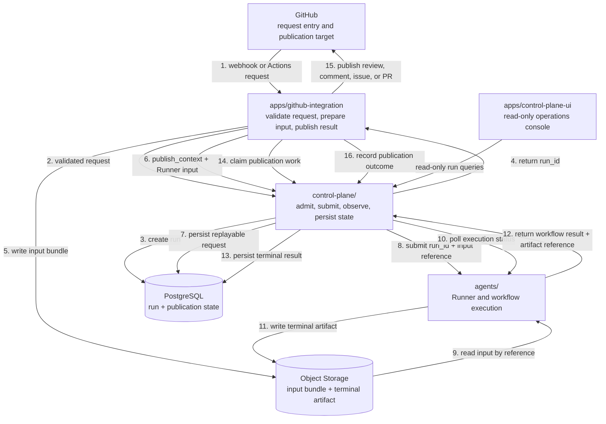

# System Architecture

Sec Review Bot contains four runtime entities with separate responsibilities and deployment boundaries:

## Normal flow

1. GitHub sends a webhook or Actions request to the integration.
2. The integration validates the platform request and asks Control Plane to admit it; the admission request does not carry the raw GitHub webhook payload.
3. Control Plane creates the run and persists its identity in PostgreSQL.
4. Control Plane returns the stable `run_id` to the integration. State, artifacts, Runner requests, and logs use this same identity.
5. The integration prepares the input bundle and writes it to Object Storage under that run identity.
6. The integration submits `publish_context` and replayable Runner input containing the input `ArtifactRef`; archive bytes remain in Object Storage.
7. Control Plane persists the Runner input before crossing the Runner boundary, allowing an uncertain submission to be replayed without reconstructing process-local state.
8. Control Plane submits the `run_id` and input reference to Runner.
9. Runner reads the input bundle from Object Storage by reference.
10. Control Plane polls Runner for execution status.
11. Runner writes the terminal artifact to Object Storage.
12. Runner returns the workflow result and terminal artifact reference to Control Plane; the artifact bytes remain in Object Storage.
13. Control Plane persists the successful terminal result and artifact reference without interpreting workflow-specific result content.
14. The integration claims the corresponding publication work. Control Plane returns the workflow result and the opaque `publish_context` originally supplied by that connector; `publish_context` contains no credentials or process-local objects.
15. The integration publishes the GitHub review, comment, issue, or pull request.
16. The integration records the publication outcome through Control Plane.

The diagram and list show the first occurrence of each step. Polling, heartbeats, retries, and state writes can repeat. Because steps 3 and 4 precede input preparation, a failure in step 5 or 6 still has a durable `run_id`; only a request rejected before admission has no `run_id`.

Integration pulls publication work from Control Plane rather than receiving a callback. Control Plane keeps successful terminal work in `pending`, atomically assigns a publication claim to the connector, and accepts the connector's success or failure outcome. This keeps GitHub-specific side effects out of Control Plane while allowing an integration restart to resume unfinished work.

`apps/github-integration/` owns GitHub request parsing, input preparation, and GitHub publication. `control-plane/` owns admission, Runner coordination, recovery, and durable run state. `agents/` owns Runner, Temporal, and workflow execution. `apps/control-plane-ui/` reads the redacted Control Plane query API and never accesses PostgreSQL directly.

Detailed Control Plane state, claim, schema, and API behavior belongs in the [Control Plane README](../../control-plane/README.md).
