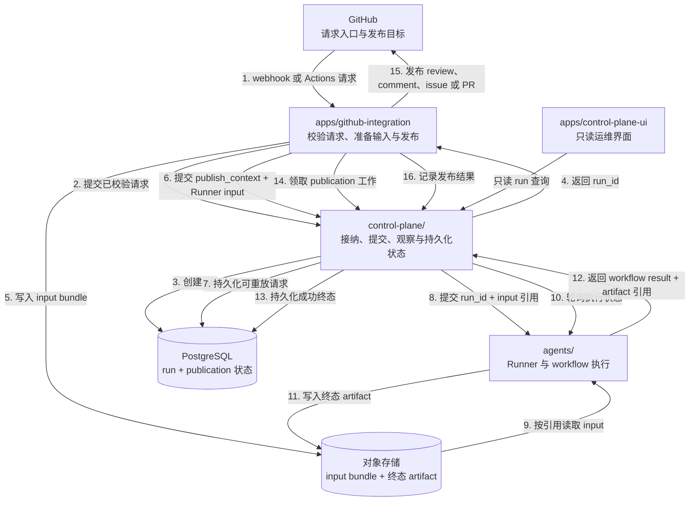

# 系统架构

Sec Review Bot 包含四个运行实体，各自拥有独立的职责和部署边界：

## 正常流程

1. GitHub 把 webhook 或 Actions 请求交给 integration。
2. Integration 校验平台请求，并请求 Control Plane 接纳它；接纳请求不携带原始 GitHub webhook payload。
3. Control Plane 创建 run，并将其身份持久化到 PostgreSQL。
4. Control Plane 把稳定的 `run_id` 返回给 integration。状态、artifact、Runner 请求和日志都使用同一个身份。
5. Integration 准备 input bundle，并使用该 run 身份将其写入对象存储。
6. Integration 向 Control Plane 提交 `publish_context` 和包含 input `ArtifactRef` 的可重放 Runner input；archive 内容仍留在对象存储。
7. Control Plane 在跨越 Runner 边界前持久化 Runner input，使状态不确定的 submission 可以重放，而不需要重建进程内状态。
8. Control Plane 向 Runner 提交 `run_id` 和 input 引用。
9. Runner 按引用从对象存储读取 input bundle。
10. Control Plane 轮询 Runner 的执行状态。
11. Runner 把终态 artifact 写入对象存储。
12. Runner 向 Control Plane 返回 workflow result 和终态 artifact 引用；artifact 内容仍留在对象存储。
13. Control Plane 持久化成功终态和 artifact 引用，但不解释 workflow 专用的 result 内容。
14. Integration 领取对应的 publication 工作。Control Plane 返回 workflow result 和该 connector 最初提交的不透明 `publish_context`；`publish_context` 不包含凭据或进程内对象。
15. Integration 发布 GitHub review、comment、issue 或 pull request。
16. Integration 通过 Control Plane 记录发布结果。

图和列表展示每一步首次发生的顺序；轮询、heartbeat、重试和状态写入可能重复多次。由于第 3、4 步早于 input 准备，第 5 或第 6 步失败时仍然存在持久化的 `run_id`；只有在接纳前被拒绝的请求没有 `run_id`。

Integration 主动从 Control Plane 领取 publication 工作，而不是等待 Control Plane 回调。Control Plane 将成功终态的工作保持为 `pending`，原子地向 connector 分配 publication claim，并接收 connector 回写的成功或失败结果。因此 GitHub 专用副作用不会进入 Control Plane，integration 重启后也能继续处理未完成工作。

`apps/github-integration/` 负责解析 GitHub 请求、准备 input 和执行 GitHub 发布。`control-plane/` 负责接纳、Runner 协调、恢复和持久化 run 状态。`agents/` 负责 Runner、Temporal 和 workflow 执行。`apps/control-plane-ui/` 读取脱敏的 Control Plane 查询 API，不直接访问 PostgreSQL。

Control Plane 的状态、claim、schema 和 API 细节见 [Control Plane README](../../control-plane/README.zh.md)。
