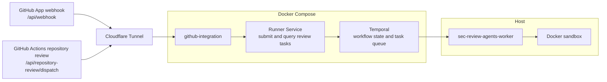

# Local Integrated Deployment

Language: English | [中文](LOCAL_INTEGRATED_DEPLOYMENT.zh.md)

This guide covers local deployment of the GitHub integration / Runner Service / Temporal control plane with a host execution worker.

Use it to run the complete integrated path locally. For running agents directly without the HTTP Runner Service, or for debugging with `run-local-* --temporal`, see the [agents local running guide](../../agents/README.md).

## Deployment Shape



Cloudflare Tunnel forwards both public endpoints to the local `github-integration` service. See [Local Webhook Setup](LOCAL_WEBHOOK_SETUP.md) for configuration.

Runner Service is the HTTP API between GitHub integration and Temporal. It authenticates and validates task requests, starts Temporal workflows, and queries task status; `sec-review-agents-worker` executes the agents.

In terms of responsibilities, the Compose services form the control plane, while the host worker is an execution node similar to a Kubernetes worker node. Without a worker, submitted tasks remain in Temporal waiting for execution.

Default local endpoints:

| Service | URL |
| --- | --- |
| GitHub integration | `http://127.0.0.1:30000` |
| Runner Service | `http://127.0.0.1:8000` |
| Temporal gRPC | `127.0.0.1:7233` |
| Temporal Web UI | `http://127.0.0.1:8233` |

## Prerequisites

### GitHub App Permission Settings

Required repository permissions:

- `Pull requests: Read and write`
- `Contents: Read and write`
- `Issues: Read and write`

Required webhook subscriptions:

- `Pull request`
- `Issues`
- `Issue comment`

Notes:

- `Metadata: Read-only` is a default GitHub App permission and does not need to be enabled manually.
- If you change App permissions, existing installations often need to approve the new permissions again.
- A common error when permissions are insufficient is `403 Resource not accessible by integration`.

### GitHub App Credentials

Download the private key from the GitHub App settings page. You can place it at the default path, `apps/github-integration/private-key.pem`.

Generate a secret in the GitHub App webhook settings and set `WEBHOOK_SECRET` in `apps/github-integration/.env` to the same value. The private key authenticates the GitHub App, while the webhook secret verifies incoming webhooks.

### GitHub App Webhook Configuration

To forward a public URL to the local GitHub integration service, see [Local Webhook Setup](LOCAL_WEBHOOK_SETUP.md).

### Actions Secrets Configuration

Repository review is triggered through GitHub Actions: [`.github/workflows/sec-review-bot.yml`](../../.github/workflows/sec-review-bot.yml)

Configure this Actions secret in the target repository:

```bash
SEC_BOT_DISPATCH_URL=https://your-bot-dev.example.com/api/repository-review/dispatch
```

The repository review workflow authenticates to the App with GitHub Actions OIDC. The workflow must have `id-token: write`, and the OIDC audience is fixed to `sec-review-bot`.

## Deployment Configuration

The integrated deployment uses four configuration files:

- repository-root `.env`: Compose control plane;
- `apps/github-integration/.env`: GitHub integration;
- `agents/config/model-providers.toml`: model deployments;
- `/etc/sec-review-bot/deployment.env`: systemd integrated service.

Create the first three from the repository root:

```bash
cp compose.env.sample .env
cp agents/config/model-providers.sample.toml agents/config/model-providers.toml
cp apps/github-integration/.env.sample apps/github-integration/.env
```

The samples contain both usable defaults and empty or placeholder values that must be replaced. At minimum, configure the Runner Service token, GitHub App credentials, and model deployment credentials. The systemd installer creates the fourth configuration file as described below.

`agents/.env` is used by `run-local-*` and other local CLIs. Compose and the systemd worker do not load it automatically. See the [agents local running guide](../../agents/README.md) for local CLI configuration.

### 1. Compose `.env`

Compose-level defaults are documented in [compose.env.sample](../../compose.env.sample). This file controls how Compose starts containers, mounts local directories, and exposes ports.

Common path settings:

```bash
RUNNER_SERVICE_TOKEN=<generate with: openssl rand -hex 32>
SEC_REVIEW_INPUT_BUNDLE_ROOT=${PWD}/.agent-input-bundles
SEC_REVIEW_APP_STATE_ROOT=${PWD}/.agent-app-state
```

### 2. GitHub Integration `.env`

GitHub integration runtime settings are documented in [apps/github-integration/.env.sample](../../apps/github-integration/.env.sample). Minimum local configuration:

```bash
APP_ID=123456
WEBHOOK_SECRET=your_webhook_secret
PORT=30000
```

Compose injects the container private-key path, Runner Service address and token, and the input bundle and App state paths. These values do not need to be repeated in `apps/github-integration/.env`.

### 3. Model Configuration

Model deployment configuration is documented in [agents/config/model-providers.sample.toml](../../agents/config/model-providers.sample.toml). The systemd worker reads the copied `agents/config/model-providers.toml` through `MODEL_PROVIDERS_CONFIG_TOML`.

Every agent that can run must be explicitly bound to a model deployment:

```toml
[[deployments]]
name = "anthropic_strong"
model = "anthropic/claude-3-7-sonnet-20250219"
max_input_tokens = 200000
api_key = "your_anthropic_key"
api_base = "https://your-anthropic-endpoint/v1"

[agent_deployment_bindings]
issue-analyzer = "anthropic_strong"
```

After changing model configuration or credentials, probe deployment availability:

```bash
cd agents
uv run sec-review-agents-check-llm-deployments
uv run sec-review-agents-check-llm-deployments --fail-fast
```

### 4. systemd Integrated Service Configuration

[`deploy/systemd/deployment.env.sample`](../../deploy/systemd/deployment.env.sample) is the configuration sample shared by the control-plane systemd service and host worker. Do not copy it into `/etc` manually. The installation step under “Run The Deployment” creates `/etc/sec-review-bot/deployment.env` when it does not exist and writes the current checkout's absolute paths into it. Review the generated configuration before starting `sec-review-bot.target` for the first time.

Core fields:

| Field | Configuration |
| --- | --- |
| `SEC_REVIEW_BOT_DIR` | Absolute repository path, generated by the installer. |
| `SEC_REVIEW_AGENTS_DIR` | Absolute `agents/` path, generated by the installer. |
| `MODEL_PROVIDERS_CONFIG_TOML` | Absolute model configuration path, generated by the installer. |
| `SEC_REVIEW_AGENT_INPUT_BUNDLE_ROOT` | Must refer to the same directory as `SEC_REVIEW_INPUT_BUNDLE_ROOT` in the repository `.env`. |
| `SEC_REVIEW_AGENT_ARTIFACT_ROOT` | Absolute directory where the worker writes run artifacts. |
| `TEMPORAL_ADDRESS` | Must use the host port exposed by `TEMPORAL_PORT` in the repository `.env`; the default is `127.0.0.1:7233`. |
| `TEMPORAL_NAMESPACE`, `TEMPORAL_TASK_QUEUE` | Must match the same-named values in the repository `.env`. |
| `AGENT_DOCKER_IMAGE` | Image used for Docker sandboxes; the default is a general-purpose image. |

Paths default to directories under the current checkout, and the Temporal and task-queue defaults match the Compose sample. They normally need no changes unless the corresponding Compose values were changed. Running the installer again does not overwrite an existing `deployment.env`.

Add or change the following variables as needed.

#### Langfuse Tracing

```bash
LANGFUSE_PUBLIC_KEY=your_public_key
LANGFUSE_SECRET_KEY=your_secret_key
LANGFUSE_BASE_URL=https://cloud.langfuse.com
```

#### Runtime Diagnostics

```bash
AGENT_LOG_LEVEL=INFO
AGENT_MODEL_TURN_DIAGNOSTICS=1
AGENT_GRAPH_MAX_STEPS=24
AGENT_GRAPH_RECURSION_BUFFER=8
```

#### Repository Workflow Concurrency

```bash
AGENT_DISCOVERY_MAX_CONCURRENCY=1
AGENT_CASE_PROCESSING_MAX_CONCURRENCY=1
```

Concurrency values limit only the number of in-flight requests. They are not TPM/RPM rate limits; quota pressure depends more on token volume, request rate, and retry behavior.

#### Docker Sandbox

```bash
AGENT_SANDBOX_BACKEND=docker
AGENT_DOCKER_IMAGE=mcr.microsoft.com/devcontainers/universal:6-noble
AGENT_DOCKER_NETWORK_MODE=none
```

With `AGENT_SANDBOX_BACKEND=docker`, the worker fails during startup when Docker is unavailable.

#### Optional CodeGraph MCP In Docker Sandbox

```bash
docker build -f agents/docker/workspace-codegraph.Dockerfile -t sec-review-bot-workspace:codegraph agents
AGENT_DOCKER_IMAGE=sec-review-bot-workspace:codegraph
AGENT_MCP_ENABLED=true
```

`deployment.env.sample` uses the general-purpose sandbox image and disables MCP by default. To use CodeGraph, build the dedicated image and enable MCP.

For local fallback, install `codegraph` on the host `PATH` and set `AGENT_MCP_ENABLED=true`. CodeGraph tools are attached only to stages that explicitly opt in and expose a writable `/workspace`.

### Integrated Deployment Paths

The integrated deployment uses these three repository-level directories:

| Path | Owner | Purpose |
| --- | --- | --- |
| `.agent-input-bundles` | Written by GitHub integration, read by the host worker | Prepared runner input materials |
| `.agent-artifacts` | Host worker | Agent artifacts and workflow output for each task |
| `.agent-app-state` | GitHub integration | Submitted-task state used by background publishing |

## Run The Deployment

### Integrated Service

Install the agents project, build the control-plane images, and confirm that the current user can access Docker:

```bash
cd agents
uv sync --frozen --no-dev
cd ..
docker info
docker compose --profile app build
```

Install the systemd units. The argument identifies the regular host user that runs Compose and the worker:

```bash
sudo deploy/systemd/install.sh "$USER"
```

Review the generated configuration as described under [systemd Integrated Service Configuration](#4-systemd-integrated-service-configuration):

```bash
sudoedit /etc/sec-review-bot/deployment.env
```

Start the complete integrated service and enable it at boot:

```bash
sudo systemctl enable --now sec-review-bot.target
```

`sec-review-bot.target` manages both the Compose control plane and `sec-review-agents-worker@1.service`. The control plane contains GitHub integration, Runner Service, and Temporal. The host worker executes review activities and creates Docker sandboxes. systemd supervises Compose in the foreground and restarts the control plane if any of its containers exits unexpectedly.

For routine lifecycle operations, use only the target:

```bash
sudo systemctl start sec-review-bot.target
sudo systemctl stop sec-review-bot.target
sudo systemctl restart sec-review-bot.target
```

Inspect the deployment status and logs:

```bash
sudo systemctl status sec-review-bot.target
sudo systemctl status sec-review-bot-control-plane.service
sudo systemctl status sec-review-agents-worker@1.service
sudo journalctl \
  -u sec-review-bot-control-plane.service \
  -u sec-review-agents-worker@1.service \
  -f
```

Disable automatic startup and stop the complete service immediately:

```bash
sudo systemctl disable --now sec-review-bot.target
```

After changing GitHub integration or Runner Service code, rebuild the images and restart the target:

```bash
docker compose --profile app build
sudo systemctl restart sec-review-bot.target
```

If an update changes a unit under `deploy/systemd`, run the installer again before restarting the target.

Check Runner Service:

```bash
RUNNER_SERVICE_TOKEN=<paste-your-token>
curl -sS http://127.0.0.1:8000/healthz \
  -H "Authorization: Bearer ${RUNNER_SERVICE_TOKEN}"
```

### Component-Level Operations

Normal operation only needs `sec-review-bot.target`. For troubleshooting or updating one component, restart the control plane or worker separately:

```bash
sudo systemctl restart sec-review-bot-control-plane.service
sudo systemctl restart sec-review-agents-worker@1.service
```

For development, you can bypass systemd and run the Compose control plane in the foreground:

```bash
docker compose --profile app up --build
```

This command does not start the host worker.

### Worker Concurrency

`TEMPORAL_ACTIVITY_WORKERS` controls the activity executor size in one worker process. Start with a conservative value such as `2`, because each activity may create a sandbox and make multiple model calls.

The systemd template can run multiple worker processes on one execution node:

```bash
sudo systemctl enable --now sec-review-agents-worker@2.service
sudo systemctl enable --now sec-review-agents-worker@3.service
```

Temporal distributes tasks among instances that share a task queue. Tune one process first; add processes or execution nodes only when measurements show that one process is a bottleneck or when process-level fault isolation is required.

## Cleanup

GitHub integration uses the container's default root user, so input bundles or App state may contain root-owned files. The host worker writes artifacts as its own user.

To repair ownership:

```bash
sudo chown -R "$USER:$USER" .agent-input-bundles .agent-artifacts .agent-app-state
```

After confirming that no tasks need to be retained, you can remove the directories instead:

```bash
sudo rm -rf .agent-input-bundles .agent-artifacts .agent-app-state
```

## Proxies

The GitHub integration image build and Git workspace fetches use separate network settings. For Compose, set these variables in the repository `.env`; for non-Compose startup, set runtime variables in the GitHub integration `.env`.

### pnpm Registry

Corepack and pnpm use `https://registry.npmjs.org` by default while building the GitHub integration image. If that endpoint is unavailable or unreliable, select a reachable registry:

```bash
NPM_CONFIG_REGISTRY=https://registry.npmmirror.com
```

This variable is passed only to Corepack and pnpm during the image build. Rebuild the GitHub integration image after changing it:

```bash
docker compose --profile app build github-integration
```

### Git Fetch

GitHub integration uses `git fetch` to retrieve the target commit while preparing a review input bundle. If the container cannot connect directly to GitHub, configure the host HTTP proxy only for these fetches:

```bash
GITHUB_INTEGRATION_GIT_HTTP_PROXY=http://host.docker.internal:7897
```

Compose maps `host.docker.internal` to the host. The proxy must listen on an address reachable from Docker containers instead of loopback only. This variable does not change the network path used by the GitHub API, Runner Service, worker, or sandboxes.

When running GitHub integration without Compose, use an address reachable by the host process instead, for example:

```bash
GITHUB_INTEGRATION_GIT_HTTP_PROXY=http://127.0.0.1:7897
```

## Troubleshooting

- `403 Resource not accessible by integration`: check GitHub App permissions and whether the installation approved changed permissions.
- Runner Service returns unauthorized: confirm that `AGENT_RUNNER_SERVICE_TOKEN` matches `RUNNER_SERVICE_TOKEN`.
- Repository dispatch authentication fails: confirm that the workflow has `id-token: write`, requests the `sec-review-bot` OIDC audience, and uses the `.github/workflows/sec-review-bot.yml` workflow path.
- Tasks remain queued: confirm that at least one host worker is running and uses the same `TEMPORAL_TASK_QUEUE` as Runner Service.
- The worker cannot read an input bundle: Compose and the host worker must use the same absolute `SEC_REVIEW_INPUT_BUNDLE_ROOT`.
- The worker writes artifacts elsewhere: check the worker's absolute `SEC_REVIEW_AGENT_ARTIFACT_ROOT`.
- LLM calls fail before workflow progress: from `agents/`, run `uv run sec-review-agents-check-llm-deployments --fail-fast`.
