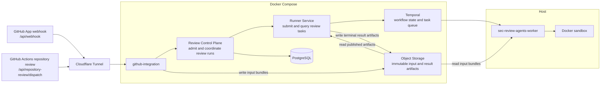

# Local Integrated Deployment

Language: English | [中文](LOCAL_INTEGRATED_DEPLOYMENT.zh.md)

This guide covers local deployment of the GitHub integration, Review Control Plane, Runner Service, Temporal, object storage, and a host execution worker.

Use it to run the complete integrated path locally. For running agents directly without the HTTP Runner Service, or for debugging with `run-local-* --temporal`, see the [agents local running guide](../../agents/README.md).

## Deployment Shape


```mermaid
flowchart LR
    webhook["GitHub App webhook<br/>/api/webhook"] --> tunnel["Cloudflare Tunnel"]
    dispatch["GitHub Actions repository review<br/>/api/repository-review/dispatch"] --> tunnel

    subgraph compose["Docker Compose"]
        integration["github-integration"] --> control["Review Control Plane<br/>admit and coordinate review runs"]
        control --> runner["Runner Service<br/>submit and query review tasks"]
        control --> postgres[(PostgreSQL)]
        runner --> temporal["Temporal<br/>workflow state and task queue"]
        integration -->|write input bundles| storage["Object Storage<br/>immutable input and result artifacts"]
        runner -->|write terminal result artifacts| storage
    end

    subgraph host["Host"]
        worker["sec-review-agents-worker"] --> sandbox["Docker sandbox"]
    end

    tunnel --> integration
    temporal --> worker
    storage -->|read input bundles| worker
    storage -->|read published artifacts| runner
```

Cloudflare Tunnel forwards both public endpoints to the local `github-integration` service. See [Local GitHub Inbound Setup](LOCAL_GITHUB_INBOUND_SETUP.md) for configuration.

Runner Service is the HTTP API between Control Plane and Temporal. It authenticates and validates task requests, starts Temporal workflows, and exposes task status; `sec-review-agents-worker` executes the agents.

Object Storage holds two kinds of run data: the input bundle prepared before execution and the result artifact produced after execution. GitHub integration writes the input bundle. The result publication path writes the terminal artifact. The worker and Runner Service read these objects when needed. The worker does not hold credentials for publishing result artifacts.

Control Plane UI is a separately deployed, read-only console. Its same-origin server authenticates the browser and calls Control Plane with a dedicated read token; neither the read token nor the mutation service token is exposed to browser code.

Without a worker, submitted tasks remain in Temporal waiting for execution.

Default local endpoints:

| Service | URL |
| --- | --- |
| GitHub integration | `http://127.0.0.1:30000` |
| Review Control Plane | `http://127.0.0.1:8090` |
| Control Plane UI | `http://127.0.0.1:8091` |
| Runner Service | `http://127.0.0.1:8000` |
| Temporal gRPC | `127.0.0.1:7233` |
| Temporal Web UI | `http://127.0.0.1:8233` |
| RustFS API | `http://127.0.0.1:9100` |
| RustFS Console | `http://127.0.0.1:9101` |

## Prerequisites

### GitHub App Permission Settings

Required repository permissions:

- `Pull requests: Read and write`
- `Contents: Read and write`
- `Issues: Read and write`

Required webhook subscriptions:

- `Pull request`
- `Issues`
- `Issue comment`

Notes:

- `Metadata: Read-only` is a default GitHub App permission and does not need to be enabled manually.
- If you change App permissions, existing installations often need to approve the new permissions again.
- A common error when permissions are insufficient is `403 Resource not accessible by integration`.

### GitHub App Credentials

Download the private key from the GitHub App settings page. You can place it at the default path, `apps/github-integration/private-key.pem`.

Generate a secret in the GitHub App webhook settings and set `WEBHOOK_SECRET` in `apps/github-integration/.env` to the same value. The private key authenticates the GitHub App, while the webhook secret verifies incoming webhooks.

### GitHub App Webhook Configuration

To forward a public URL to the local GitHub integration service, see [Local GitHub Inbound Setup](LOCAL_GITHUB_INBOUND_SETUP.md).

### Actions Secrets Configuration

Repository review is triggered through GitHub Actions: [`.github/workflows/sec-review-bot.yml`](../../.github/workflows/sec-review-bot.yml)

Configure this Actions secret in the target repository:

```bash
SEC_BOT_DISPATCH_URL=https://your-bot-dev.example.com/api/repository-review/dispatch
```

The repository review workflow authenticates to the App with GitHub Actions OIDC. The workflow must have `id-token: write`, and the OIDC audience is fixed to `sec-review-bot`.

## Deployment Configuration

The integrated deployment uses four source configuration files. Compose `.env` also carries the object-storage endpoint and service credentials; these credentials are passed to the appropriate service only:

- repository-root `.env`: Compose control plane;
- `apps/github-integration/.env`: GitHub integration;
- `agents/config/model-providers.toml`: model deployments;
- `ops/systemd/deployment.env`: systemd deployment configuration before installation.

The installer combines these settings with checkout-derived paths and writes the systemd services' effective configuration to `/etc/sec-review-bot/deployment.env`.

Create the configuration files from the repository root:

```bash
cp compose.env.sample .env
cp agents/config/model-providers.sample.toml agents/config/model-providers.toml
cp apps/github-integration/.env.sample apps/github-integration/.env
cp ops/systemd/deployment.env.sample ops/systemd/deployment.env
chmod 600 .env \
  agents/config/model-providers.toml \
  apps/github-integration/.env \
  ops/systemd/deployment.env
```

The samples contain both usable defaults and empty or placeholder values that must be replaced. At minimum, configure the Runner Service token, GitHub App credentials, and model deployment credentials. The systemd installer combines the deployment settings with repository paths and writes the result to `/etc` as described below.

`agents/.env` is used by `run-local-*` and other local CLIs. Compose and the systemd worker do not load it automatically. See the [agents local running guide](../../agents/README.md) for local CLI configuration.

### 1. Compose `.env`

Compose-level defaults are documented in [compose.env.sample](../../compose.env.sample). This file controls how Compose starts containers, mounts local directories, and exposes ports.

Set `RUNNER_SERVICE_TOKEN` and the PostgreSQL/RustFS passwords to locally generated secrets, for example with `openssl rand -hex 32`. Compose-owned state uses the fixed repository directories `.agent-temporal-state`, `.agent-rustfs-state`, and `.agent-postgres-state`; they are intentionally not separate configuration values. RustFS stores immutable input archives; the integration credential can write input objects and the host worker credential is read-only.

### 2. GitHub Integration `.env`

GitHub integration runtime settings are documented in [apps/github-integration/.env.sample](../../apps/github-integration/.env.sample). Minimum local configuration:

```bash
APP_ID=123456
WEBHOOK_SECRET=your_webhook_secret
PORT=30000
```

Compose injects the Runner Service address and token only into Control Plane for initial submission, submission recovery, and terminal observation. It injects the container private-key path, Control Plane address and token, and RustFS input storage configuration into the integration. PostgreSQL and Runner credentials are not available to the integration. These values do not need to be repeated in `apps/github-integration/.env`.

### 3. Model Configuration

Model deployment configuration is documented in [agents/config/model-providers.sample.toml](../../agents/config/model-providers.sample.toml). The systemd worker reads the copied `agents/config/model-providers.toml` through `MODEL_PROVIDERS_CONFIG_TOML`.

Every agent that can run must be explicitly bound to a model deployment:

```toml
[[deployments]]
name = "anthropic_strong"
model = "anthropic/claude-3-7-sonnet-20250219"
max_input_tokens = 200000
api_key = "your_anthropic_key"
api_base = "https://your-anthropic-endpoint/v1"

[agent_deployment_bindings]
issue-analyzer = "anthropic_strong"
```

After changing model configuration or credentials, probe deployment availability:

```bash
cd agents
uv run sec-review-agents-check-llm-deployments
uv run sec-review-agents-check-llm-deployments --fail-fast
```

### 4. systemd Integrated Service Configuration

`ops/systemd/deployment.env` is the editable source configuration. Every time the installer runs, it combines that file with paths derived from the current checkout and replaces `/etc/sec-review-bot/deployment.env`. Both the control-plane service and host worker read the installed file.

The installer owns `SEC_REVIEW_BOT_DIR` and `SEC_REVIEW_AGENTS_DIR`. Do not add them to the editable source file. The installer removes stale values and regenerates them from its own repository location. Input archives are exchanged through RustFS, so the integration container and host worker no longer share `.agent-input-bundles`.

The installer also generates the internal `SEC_REVIEW_SERVICE_UID` and `SEC_REVIEW_SERVICE_GID` values. Before Compose starts, it creates the repository-local state directories for that service user. This prevents Docker from creating unwritable root-owned bind-mount sources and lets the Temporal container write its SQLite database as the same user.

Materialized run inputs and generated artifacts default to `.agent-run-inputs` and `.agent-artifacts`. Model configuration defaults to `agents/config/model-providers.toml` in the current checkout. Most installations should keep these defaults. To move them, set an absolute `SEC_REVIEW_AGENT_RUN_INPUT_ROOT`, `SEC_REVIEW_AGENT_ARTIFACT_ROOT`, or `MODEL_PROVIDERS_CONFIG_TOML` in `ops/systemd/deployment.env`; the installer preserves non-empty overrides for these independent worker paths.

If [`ops/systemd/deployment.env.sample`](../../ops/systemd/deployment.env.sample) gains new options, add the relevant options to `ops/systemd/deployment.env` manually.

Core fields:

| Field | Configuration |
| --- | --- |
| `TEMPORAL_ADDRESS` | Must use the host port exposed by `TEMPORAL_PORT` in the repository `.env`; the default is `127.0.0.1:7233`. |
| `TEMPORAL_NAMESPACE`, `TEMPORAL_TASK_QUEUE` | Must match the same-named values in the repository `.env`. |
| `AGENT_DOCKER_IMAGE` | Image used for Docker sandboxes; the default is a general-purpose image. |
| `SEC_REVIEW_ARTIFACT_S3_ENDPOINT` | Host-worker endpoint for RustFS; the Compose default is exposed at `http://127.0.0.1:9100`. |
| `AWS_ACCESS_KEY_ID`, `AWS_SECRET_ACCESS_KEY` | Read-only RustFS credential matching the runner values in the repository `.env`. |

The Runner service receives a separate artifact-publisher credential through Compose. It can write only `runs/*/artifacts/*`; the host worker has no object-storage credential. The service reads the worker's artifact root through a read-only bind mount when a terminal run is observed.

Most local deployments can keep these defaults. Rerun the installer after moving the checkout.

Add or change the following variables as needed.

#### Langfuse Tracing

[Langfuse](https://langfuse.com/docs) is an optional external observability service. It is not part of this repository's Compose control plane. Use [Langfuse Cloud](https://cloud.langfuse.com) or run a separate [self-hosted Langfuse deployment](https://langfuse.com/self-hosting), create a project and API keys there, then set all three variables together in `ops/systemd/deployment.env` and rerun the installer:

```bash
LANGFUSE_PUBLIC_KEY=your_public_key
LANGFUSE_SECRET_KEY=your_secret_key
LANGFUSE_BASE_URL=https://cloud.langfuse.com
```

#### Runtime Diagnostics

```bash
AGENT_LOG_LEVEL=INFO
AGENT_MODEL_TURN_DIAGNOSTICS=1
AGENT_GRAPH_MAX_STEPS=24
AGENT_GRAPH_RECURSION_BUFFER=8
```

#### Repository Workflow Concurrency

```bash
AGENT_DISCOVERY_MAX_CONCURRENCY=1
AGENT_CASE_PROCESSING_MAX_CONCURRENCY=1
```

Concurrency values limit only the number of in-flight requests. They are not TPM/RPM rate limits; quota pressure depends more on token volume, request rate, and retry behavior.

#### Docker Sandbox

`deployment.env.sample` uses the general-purpose sandbox image and disables MCP by default:

```bash
AGENT_SANDBOX_BACKEND=docker
AGENT_DOCKER_IMAGE=mcr.microsoft.com/devcontainers/universal:6-noble
AGENT_DOCKER_NETWORK_MODE=none
```

With `AGENT_SANDBOX_BACKEND=docker`, the worker fails during startup when Docker is unavailable.

To enable CodeGraph MCP in the sandbox, build the dedicated image and update the image and MCP settings:

```bash
docker build -f agents/docker/workspace-codegraph.Dockerfile -t sec-review-bot-workspace:codegraph agents
AGENT_DOCKER_IMAGE=sec-review-bot-workspace:codegraph
AGENT_MCP_ENABLED=true
```

For local fallback, install `codegraph` on the host `PATH` and set `AGENT_MCP_ENABLED=true`. CodeGraph tools are attached only to stages that explicitly opt in and expose a writable `/workspace`.

### Integrated Deployment Paths

With the sample configuration, the integrated deployment stores runtime data in these repository-level paths:

| Path | Owner | Purpose |
| --- | --- | --- |
| `.agent-rustfs-state` | RustFS | Persistent object storage for input archives exchanged between integration and Runner |
| `.agent-run-inputs` | Host worker | Materialized input for active runs; never included in published diagnostic bundles |
| `.agent-artifacts` | Host worker | Agent artifacts and workflow output for each task |
| `.agent-postgres-state` | PostgreSQL | Admission, Runner observation, and publication step coordination |
| `.agent-temporal-state` | Temporal | Workflow history and pending task state |
| `.agent-memory` | Host worker | Persistent agent memory store, when memory is enabled |

## Run The Deployment

### Integrated Service

Install the agents project, build the control-plane images, and confirm that the current user can access Docker:

```bash
cd agents
uv sync --frozen --no-dev
cd ..
docker info
docker compose --profile app build
```

Review `ops/systemd/deployment.env`, then install the systemd units. The argument identifies the regular host user that runs Compose and the worker:

```bash
sudo ops/systemd/install.sh "$USER"
```

Start the complete integrated service and enable it at boot:

```bash
sudo systemctl enable --now sec-review-bot.target
```

`sec-review-bot.target` is the single systemd entry point for the complete deployment. It groups the Compose control plane with `sec-review-agents-worker@1.service` so they can be managed together.

The control plane contains GitHub integration, Runner Service, and Temporal. The host worker executes review activities and creates Docker sandboxes. systemd restarts the control plane if one of its containers exits unexpectedly.

For routine lifecycle operations, use only the target:

```bash
sudo systemctl start sec-review-bot.target
sudo systemctl stop sec-review-bot.target
sudo systemctl restart sec-review-bot.target
```

Temporal development-server state is stored under `.agent-temporal-state`, so these routine lifecycle operations preserve workflow history and pending tasks.

Inspect the deployment status and logs:

```bash
sudo systemctl status sec-review-bot.target
sudo systemctl status sec-review-bot-control-plane.service
sudo systemctl status sec-review-agents-worker@1.service
sudo journalctl \
  -u sec-review-bot-control-plane.service \
  -u sec-review-agents-worker@1.service \
  -f
```

Disable automatic startup and stop the complete service immediately:

```bash
sudo systemctl disable --now sec-review-bot.target
```

After changing code, rebuild the images and restart the complete service:

```bash
docker compose --profile app build
sudo systemctl restart sec-review-bot.target
```

After changing installation files under `ops/systemd`, run the installer again before restarting the service.

Check Runner Service:

```bash
RUNNER_SERVICE_TOKEN=<paste-your-token>
curl -sS http://127.0.0.1:8000/healthz \
  -H "Authorization: Bearer ${RUNNER_SERVICE_TOKEN}"
```

### Component-Level Operations

For troubleshooting or updating one component, restart the control plane or worker separately:

```bash
sudo systemctl restart sec-review-bot-control-plane.service
sudo systemctl restart sec-review-agents-worker@1.service
```

For development, you can bypass systemd and run the Compose control plane in the foreground:

```bash
docker compose --profile app up --build
```

This command does not start the host worker.

### Worker Concurrency

`TEMPORAL_MAX_CONCURRENT_ACTIVITIES` limits how many activities one worker process can execute at once. It defaults to `2`; each activity may create a sandbox and make multiple model calls, so a single-node deployment should start with this conservative value.

The systemd template can run multiple worker processes on one execution node:

```bash
sudo systemctl enable --now sec-review-agents-worker@2.service
sudo systemctl enable --now sec-review-agents-worker@3.service
```

Temporal distributes tasks among instances that share a task queue. Tune one process first; add processes or execution nodes only when measurements show that one process is a bottleneck or when process-level fault isolation is required.

## Cleanup

GitHub integration uses the container's default root user for local staging files. Durable input archives live in RustFS, and the host worker writes runtime artifacts as its own user.

To repair ownership:

```bash
sudo chown -R "$USER:$USER" .agent-run-inputs .agent-artifacts .agent-rustfs-state .agent-postgres-state .agent-temporal-state
```

The PostgreSQL coordination store and Temporal state describe the same active runs. Do not delete `.agent-temporal-state` while retaining PostgreSQL records that still need polling or publication. To reset run execution and publication state, stop the complete service and remove both state directories together:

```bash
sudo systemctl stop sec-review-bot.target
sudo rm -rf .agent-temporal-state .agent-postgres-state
sudo systemctl start sec-review-bot.target
```

This permanently deletes workflow history, pending tasks, polling state, and publication state. The materials prepared before a run starts (the archive uploaded to RustFS) and the diagnostic materials produced after a run ends currently have no automatic retention period; their corresponding local files are also retained indefinitely by default for recovery, replay, and diagnostics. The deployment does not configure lifecycle expiration, so the operator must monitor disk usage. They can be removed manually after confirming that no retained run needs them:

```bash
sudo rm -rf .agent-rustfs-state .agent-run-inputs .agent-artifacts
```

The `.agent-memory` directory is persistent across runs and is not part of routine cleanup. To deliberately reset agent memory, stop the worker first and remove `.agent-memory` separately. This permanently deletes extracted observations and maintained memory.

### Backup and recovery

RustFS state and PostgreSQL state are independent data sets. Back up `.agent-rustfs-state` and `.agent-postgres-state` together with the deployment configuration, but store passwords and access keys in the secret manager rather than in the backup archive. A recovery must restore RustFS first, run the RustFS initializer to reconcile the bucket and policies, and then restore PostgreSQL so run records can resolve their stored artifact references. The initializer is safe to run repeatedly; it does not replace existing objects.

```bash
sudo rm -rf .agent-memory
```

## Proxies

The GitHub integration image build and Git workspace fetches use separate network settings. For Compose, set these variables in the repository `.env`; for non-Compose startup, set runtime variables in the GitHub integration `.env`.

### pnpm Registry

Corepack and pnpm use `https://registry.npmjs.org` by default while building the GitHub integration image. If that endpoint is unavailable or unreliable, select a reachable registry:

```bash
NPM_CONFIG_REGISTRY=https://registry.npmmirror.com
```

This variable is passed only to Corepack and pnpm during the image build. Rebuild the GitHub integration image after changing it:

```bash
docker compose --profile app build github-integration
```

### Git Fetch

GitHub integration uses `git fetch` to retrieve the target commit while preparing a review input bundle. If the container cannot connect directly to GitHub, configure the host HTTP proxy only for these fetches:

```bash
GITHUB_INTEGRATION_GIT_HTTP_PROXY=http://host.docker.internal:7897
```

Compose maps `host.docker.internal` to the host. The proxy must listen on an address reachable from Docker containers instead of loopback only. This variable does not change the network path used by the GitHub API, Runner Service, worker, or sandboxes.

When running GitHub integration without Compose, use an address reachable by the host process instead, for example:

```bash
GITHUB_INTEGRATION_GIT_HTTP_PROXY=http://127.0.0.1:7897
```

## Troubleshooting

- `403 Resource not accessible by integration`: check GitHub App permissions and whether the installation approved changed permissions.
- Runner Service returns unauthorized: check `RUNNER_SERVICE_TOKEN` in the repository `.env`, then restart the complete service.
- Repository dispatch authentication fails: confirm that the workflow has `id-token: write`, requests the `sec-review-bot` OIDC audience, and uses the `.github/workflows/sec-review-bot.yml` workflow path.
- Tasks remain queued: confirm that at least one host worker is running and uses the same `TEMPORAL_TASK_QUEUE` as Runner Service.
- The worker cannot read an input bundle: check the RustFS endpoint and ensure the installed worker credential matches the read-only credential initialized by Compose.
- The worker writes artifacts elsewhere: check the optional `SEC_REVIEW_AGENT_ARTIFACT_ROOT` override in `ops/systemd/deployment.env`, then rerun `sudo ops/systemd/install.sh "$USER"`.
- LLM calls fail before workflow progress: from `agents/`, run `uv run sec-review-agents-check-llm-deployments --fail-fast`.
