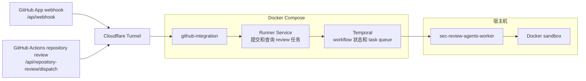

# 本地集成部署

语言：[English](LOCAL_INTEGRATED_DEPLOYMENT.md) | 中文

本文是 [LOCAL_INTEGRATED_DEPLOYMENT.md](LOCAL_INTEGRATED_DEPLOYMENT.md) 的中文译文。英文版是权威版本；如果两者不一致，以英文版为准。

这是 GitHub integration / 运行服务 / Temporal 控制平面与宿主机执行 worker 的本地部署说明。

如果你要在本地跑完整集成链路，读本文。不经过 HTTP 运行服务、直接在本地运行 agent，或使用 `run-local-* --temporal` 调试时，见 [agents 本地运行说明](../../agents/README.zh.md)。

## 部署结构



Cloudflare Tunnel 将两个公网 endpoint 转发到本地 `github-integration`。具体配置见[本地 webhook 设置](LOCAL_WEBHOOK_SETUP.zh.md)。

Runner Service 是 GitHub integration 与 Temporal 之间的 HTTP API。它负责鉴权、校验任务请求、启动 Temporal workflow 和查询任务状态；agent 由 `sec-review-agents-worker` 执行。

职责上，Compose 中的服务构成控制平面，宿主机 worker 是类似 Kubernetes worker node 的执行节点。没有 worker 时，提交的任务会停留在 Temporal 中等待执行。

默认本地端口：

| Service | URL |
| --- | --- |
| GitHub integration | `http://127.0.0.1:30000` |
| Runner Service | `http://127.0.0.1:8000` |
| Temporal gRPC | `127.0.0.1:7233` |
| Temporal Web UI | `http://127.0.0.1:8233` |

## 前提

### GitHub App 权限设置

需要的 repository permissions：

- `Pull requests: Read and write`
- `Contents: Read and write`
- `Issues: Read and write`

需要订阅的 webhook：

- `Pull request`
- `Issues`
- `Issue comment`

补充：

- `Metadata: Read-only` 是 GitHub App 默认权限，不需要手动额外开启。
- 如果修改了 App 权限，已有 installation 往往需要重新批准权限。
- 权限不够时，常见报错是 `403 Resource not accessible by integration`。

### GitHub App 凭据

从 GitHub App 设置页面下载私钥，可以放在默认位置 `apps/github-integration/private-key.pem`。

在 GitHub App 的 webhook 设置中生成一个 secret，并把相同的值写入 `apps/github-integration/.env` 的 `WEBHOOK_SECRET`。私钥用于 GitHub App 身份认证，webhook secret 用于校验收到的 webhook。

### GitHub App webhook 配置

如果要把公网 URL 转发到本地 GitHub integration service，见 [本地 webhook 设置](LOCAL_WEBHOOK_SETUP.zh.md)。

### Actions secrets 配置

仓库级 review 通过 GitHub Actions 触发：[`.github/workflows/sec-review-bot.yml`](../../.github/workflows/sec-review-bot.yml)

目标仓库需要配置 Actions secrets：

```bash
SEC_BOT_DISPATCH_URL=https://your-bot-dev.example.com/api/repository-review/dispatch
```

Repository review workflow 使用 GitHub Actions OIDC 向 App 鉴权。workflow 必须配置 `id-token: write`，OIDC audience 固定为 `sec-review-bot`。

## 部署配置

集成部署使用四份配置：

- 根目录 `.env`：Compose 控制平面；
- `apps/github-integration/.env`：GitHub integration；
- `agents/config/model-providers.toml`：模型 deployment；
- `/etc/sec-review-bot/deployment.env`：systemd 集成服务。

先在仓库根目录创建前三份配置：

```bash
cp compose.env.sample .env
cp agents/config/model-providers.sample.toml agents/config/model-providers.toml
cp apps/github-integration/.env.sample apps/github-integration/.env
```

Sample 中既有可直接使用的默认值，也有必须替换的空值和占位值。至少需要填写 Runner Service token、GitHub App 凭据和模型 deployment 凭据。第四份配置由 systemd 安装脚本创建，见下文。

`agents/.env` 供 `run-local-*` 和其他本地 CLI 使用，不会被 Compose 或 systemd worker 自动读取。本地 CLI 的配置方式见 [agents 本地运行说明](../../agents/README.zh.md)。

### 1. Compose `.env`

Compose 层默认值在 [compose.env.sample](../../compose.env.sample)。这个文件只管 Compose 怎么启动容器、挂载哪些本地目录、暴露哪些端口。

常用路径配置：

```bash
RUNNER_SERVICE_TOKEN=<用 openssl rand -hex 32 生成>
SEC_REVIEW_INPUT_BUNDLE_ROOT=${PWD}/.agent-input-bundles
SEC_REVIEW_APP_STATE_ROOT=${PWD}/.agent-app-state
```

### 2. GitHub integration `.env`

GitHub integration 运行配置见 [apps/github-integration/.env.sample](../../apps/github-integration/.env.sample)。本地最小配置：

```bash
APP_ID=123456
WEBHOOK_SECRET=your_webhook_secret
PORT=30000
```

Compose 会注入容器内私钥路径、Runner Service 地址和 token，以及 input bundle 和 App state 路径；这些值不需要在 `apps/github-integration/.env` 中重复配置。

### 3. 模型配置

模型 deployment 配置见 [agents/config/model-providers.sample.toml](../../agents/config/model-providers.sample.toml)。Systemd worker 通过 `MODEL_PROVIDERS_CONFIG_TOML` 读取复制后的 `agents/config/model-providers.toml`。

所有运行到的 agent 都必须显式绑定模型 deployment：

```toml
[[deployments]]
name = "anthropic_strong"
model = "anthropic/claude-3-7-sonnet-20250219"
max_input_tokens = 200000
api_key = "your_anthropic_key"
api_base = "https://your-anthropic-endpoint/v1"

[agent_deployment_bindings]
issue-analyzer = "anthropic_strong"
```

修改模型配置或凭据后，可以探测 deployment 可用性：

```bash
cd agents
uv run sec-review-agents-check-llm-deployments
uv run sec-review-agents-check-llm-deployments --fail-fast
```

### 4. systemd 集成服务配置

[`deploy/systemd/deployment.env.sample`](../../deploy/systemd/deployment.env.sample) 是控制平面 systemd service 和宿主机 worker 共用的配置样例。不要手动把它复制到 `/etc`；“运行部署”中的安装步骤会在文件不存在时生成 `/etc/sec-review-bot/deployment.env`，并把当前 checkout 的绝对路径写入其中。首次启动 `sec-review-bot.target` 前需要检查生成的配置。

核心字段：

| Field | 如何配置 |
| --- | --- |
| `SEC_REVIEW_BOT_DIR` | 当前仓库的绝对路径，由安装脚本生成。 |
| `SEC_REVIEW_AGENTS_DIR` | `agents/` 的绝对路径，由安装脚本生成。 |
| `MODEL_PROVIDERS_CONFIG_TOML` | 模型配置文件的绝对路径，由安装脚本生成。 |
| `SEC_REVIEW_AGENT_INPUT_BUNDLE_ROOT` | 必须与根目录 `.env` 的 `SEC_REVIEW_INPUT_BUNDLE_ROOT` 指向同一目录。 |
| `SEC_REVIEW_AGENT_ARTIFACT_ROOT` | Worker 写入运行产物的绝对路径。 |
| `TEMPORAL_ADDRESS` | 必须使用根目录 `.env` 中 `TEMPORAL_PORT` 暴露的宿主机端口；默认是 `127.0.0.1:7233`。 |
| `TEMPORAL_NAMESPACE`、`TEMPORAL_TASK_QUEUE` | 必须与根目录 `.env` 中的同名值一致。 |
| `AGENT_DOCKER_IMAGE` | Docker sandbox 使用的镜像；默认使用通用镜像。 |

路径默认指向当前 checkout 下的目录，Temporal 和 task queue 默认值也与 Compose sample 一致，因此未修改相关 Compose 值时通常无需调整。再次运行安装脚本不会覆盖已有的 `deployment.env`。

以下变量按需添加或修改。

#### Langfuse tracing

```bash
LANGFUSE_PUBLIC_KEY=your_public_key
LANGFUSE_SECRET_KEY=your_secret_key
LANGFUSE_BASE_URL=https://cloud.langfuse.com
```

#### Runtime diagnostics

```bash
AGENT_LOG_LEVEL=INFO
AGENT_MODEL_TURN_DIAGNOSTICS=1
AGENT_GRAPH_MAX_STEPS=24
AGENT_GRAPH_RECURSION_BUFFER=8
```

#### Repository workflow 并发

```bash
AGENT_DISCOVERY_MAX_CONCURRENCY=1
AGENT_CASE_PROCESSING_MAX_CONCURRENCY=1
```

并发值只限制同时在飞请求数，不等价于 TPM/RPM 限流控制；是否触发配额更取决于 token 体积、请求速率和重试行为。

#### Docker sandbox

```bash
AGENT_SANDBOX_BACKEND=docker
AGENT_DOCKER_IMAGE=mcr.microsoft.com/devcontainers/universal:6-noble
AGENT_DOCKER_NETWORK_MODE=none
```

执行节点使用 `AGENT_SANDBOX_BACKEND=docker` 后，Docker 不可用时 worker 会在启动阶段失败。

#### Docker sandbox 下的可选 CodeGraph MCP

```bash
docker build -f agents/docker/workspace-codegraph.Dockerfile -t sec-review-bot-workspace:codegraph agents
AGENT_DOCKER_IMAGE=sec-review-bot-workspace:codegraph
AGENT_MCP_ENABLED=true
```

`deployment.env.sample` 默认使用通用 sandbox 镜像并关闭 MCP。需要 CodeGraph 时，再构建专用镜像并启用 MCP。

本地 fallback 下，需要在 host `PATH` 上安装 `codegraph`，并设置 `AGENT_MCP_ENABLED=true`。CodeGraph tools 只会挂到显式 opt in、并且暴露可写 `/workspace` 的阶段。

### 集成部署路径

集成部署使用以下三个仓库级目录：

| Path | Owner | Purpose |
| --- | --- | --- |
| `.agent-input-bundles` | GitHub integration 写入，宿主机 worker 读取 | 准备好的 runner 输入材料 |
| `.agent-artifacts` | 宿主机 worker | 每次运行的 agent 产物和 workflow 输出 |
| `.agent-app-state` | GitHub integration | 后台发布流程使用的 submitted-run state |

## 运行部署

### 集成服务

先安装 agents 项目，构建控制平面镜像，并确认当前用户可以访问 Docker：

```bash
cd agents
uv sync --frozen --no-dev
cd ..
docker info
docker compose --profile app build
```

安装 systemd units。参数指定实际运行 Compose 和 worker 的普通宿主机用户：

```bash
sudo deploy/systemd/install.sh "$USER"
```

按 [systemd 集成服务配置](#4-systemd-集成服务配置)检查生成的配置：

```bash
sudoedit /etc/sec-review-bot/deployment.env
```

启动完整集成服务，并配置为随系统启动：

```bash
sudo systemctl enable --now sec-review-bot.target
```

`sec-review-bot.target` 同时管理 Compose 控制平面和 `sec-review-agents-worker@1.service`。控制平面包括 GitHub integration、Runner Service 和 Temporal；worker 在宿主机执行 review activity 并创建 Docker sandbox。Compose 以前台进程受 systemd 监督；任一控制平面容器意外退出时，systemd 会重新启动控制平面。

日常启停和重启只操作 target：

```bash
sudo systemctl start sec-review-bot.target
sudo systemctl stop sec-review-bot.target
sudo systemctl restart sec-review-bot.target
```

查看整体状态和日志：

```bash
sudo systemctl status sec-review-bot.target
sudo systemctl status sec-review-bot-control-plane.service
sudo systemctl status sec-review-agents-worker@1.service
sudo journalctl \
  -u sec-review-bot-control-plane.service \
  -u sec-review-agents-worker@1.service \
  -f
```

取消随系统启动并立即停止完整服务：

```bash
sudo systemctl disable --now sec-review-bot.target
```

修改 GitHub integration 或 Runner Service 代码后，重新构建镜像，再重启 target：

```bash
docker compose --profile app build
sudo systemctl restart sec-review-bot.target
```

如果更新包含 `deploy/systemd` 下的 unit，再运行一次安装脚本后重启 target。

验证 Runner Service：

```bash
RUNNER_SERVICE_TOKEN=<paste-your-token>
curl -sS http://127.0.0.1:8000/healthz \
  -H "Authorization: Bearer ${RUNNER_SERVICE_TOKEN}"
```

### 组件级操作

正常运行只需要操作 `sec-review-bot.target`。排障或只更新一个组件时，可以单独重启控制平面或 worker：

```bash
sudo systemctl restart sec-review-bot-control-plane.service
sudo systemctl restart sec-review-agents-worker@1.service
```

也可以绕过 systemd，在前台启动 Compose 控制平面进行开发调试：

```bash
docker compose --profile app up --build
```

这个命令不会启动宿主机 worker。

### Worker 并发

`TEMPORAL_ACTIVITY_WORKERS` 控制单个 worker 进程的 activity executor 大小。建议从 `2` 这样的保守值开始，因为每个 activity 都可能创建 sandbox 并发出多次模型请求。

systemd template 可以在同一执行节点运行多个 worker 进程：

```bash
sudo systemctl enable --now sec-review-agents-worker@2.service
sudo systemctl enable --now sec-review-agents-worker@3.service
```

Temporal 会在共用 task queue 的实例之间分配任务。应先调整单进程配置；只有测量表明单进程成为瓶颈，或需要进程级故障隔离时，再增加进程或执行节点。

## 清理

GitHub integration 使用容器默认 root 用户，因此 input bundle 或 App state 中可能出现 root-owned 文件。宿主机 worker 会以自身用户身份写入 artifacts。

可用下面命令修复 ownership：

```bash
sudo chown -R "$USER:$USER" .agent-input-bundles .agent-artifacts .agent-app-state
```

确认不需要保留 run 后也可以直接删除：

```bash
sudo rm -rf .agent-input-bundles .agent-artifacts .agent-app-state
```

## 代理

GitHub integration 的镜像构建和 Git workspace 拉取使用不同的网络配置。Compose 部署在根目录 `.env` 中设置这些变量；非 Compose 启动时，在 GitHub integration 的 `.env` 中设置运行时变量。

### pnpm registry

构建 GitHub integration 镜像时，Corepack 和 pnpm 默认访问 `https://registry.npmjs.org`。该地址不可用或速度不稳定时，可以改用可达的 registry：

```bash
NPM_CONFIG_REGISTRY=https://registry.npmmirror.com
```

这个变量只在镜像构建阶段传给 Corepack 和 pnpm。修改后需要重新构建 GitHub integration 镜像：

```bash
docker compose --profile app build github-integration
```

### Git fetch

GitHub integration 在准备 review input bundle 时通过 `git fetch` 拉取目标 commit。如果容器无法直接连接 GitHub，可以只为这些 fetch 配置宿主机 HTTP 代理：

```bash
GITHUB_INTEGRATION_GIT_HTTP_PROXY=http://host.docker.internal:7897
```

Compose 会把 `host.docker.internal` 映射到宿主机。代理必须监听 Docker 容器可访问的地址，而不是只监听 `127.0.0.1`。这个变量不会改变 GitHub API、Runner Service、worker 或 sandbox 的网络路径。

非 Compose 启动 GitHub integration 时，可以改用宿主机进程能够访问的地址，例如：

```bash
GITHUB_INTEGRATION_GIT_HTTP_PROXY=http://127.0.0.1:7897
```

## 排障

- `403 Resource not accessible by integration`：检查 GitHub App 权限，以及 installation 是否重新批准过新权限。
- Runner service 返回 unauthorized：确认 `AGENT_RUNNER_SERVICE_TOKEN` 和 `RUNNER_SERVICE_TOKEN` 一致。
- Repository dispatch 鉴权失败：确认 workflow 配置了 `id-token: write`，请求了 `sec-review-bot` OIDC audience，并且 workflow 路径是 `.github/workflows/sec-review-bot.yml`。
- Run 一直处于 queued：确认至少有一个宿主机 worker 正在运行，并与 Runner Service 使用相同的 `TEMPORAL_TASK_QUEUE`。
- Worker 读不到 input bundle：Compose 和宿主机 worker 应使用相同的绝对 `SEC_REVIEW_INPUT_BUNDLE_ROOT`。
- Worker 把 artifact 写到其他位置：检查 worker 使用的绝对 `SEC_REVIEW_AGENT_ARTIFACT_ROOT`。
- LLM 调用在 workflow 推进前失败：进入 `agents/` 后运行 `uv run sec-review-agents-check-llm-deployments --fail-fast`。
