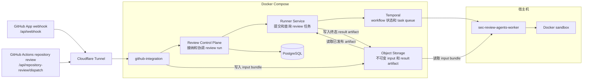

# 本地集成部署

语言：[English](LOCAL_INTEGRATED_DEPLOYMENT.md) | 中文

本文是 [LOCAL_INTEGRATED_DEPLOYMENT.md](LOCAL_INTEGRATED_DEPLOYMENT.md) 的中文译文。英文版是权威版本；如果两者不一致，以英文版为准。

这是 GitHub integration、Review Control Plane、运行服务、Temporal、对象存储与宿主机执行 worker 的本地部署说明。

如果你要在本地跑完整集成链路，读本文。不经过 HTTP 运行服务、直接在本地运行 agent，或使用 `run-local-* --temporal` 调试时，见 [agents 本地运行说明](../../agents/README.zh.md)。

## 部署结构


```mermaid
flowchart LR
    webhook["GitHub App webhook<br/>/api/webhook"] --> tunnel["Cloudflare Tunnel"]
    dispatch["GitHub Actions repository review<br/>/api/repository-review/dispatch"] --> tunnel

    subgraph compose["Docker Compose"]
        integration["github-integration"] --> control["Review Control Plane<br/>接纳和协调 review run"]
        control --> runner["Runner Service<br/>提交和查询 review 任务"]
        control --> postgres[(PostgreSQL)]
        runner --> temporal["Temporal<br/>workflow 状态和 task queue"]
        integration -->|写入 input bundle| storage["Object Storage<br/>不可变 input 和 result artifact"]
        runner -->|写入终态 result artifact| storage
    end

    subgraph host["宿主机"]
        worker["sec-review-agents-worker"] --> sandbox["Docker sandbox"]
    end

    tunnel --> integration
    temporal --> worker
    storage -->|读取 input bundle| worker
    storage -->|读取已发布 artifact| runner
```

Cloudflare Tunnel 将两个公网 endpoint 转发到本地 `github-integration`。具体配置见[本地 GitHub 入站设置](LOCAL_GITHUB_INBOUND_SETUP.zh.md)。

Runner Service 是 Control Plane 与 Temporal 之间的 HTTP API。它负责鉴权、校验任务请求、启动 Temporal workflow，并提供任务状态查询；agent 由 `sec-review-agents-worker` 执行。

对象存储保存两类运行数据：执行前准备的 input bundle，以及执行结束后生成的 result artifact。GitHub integration 写入 input bundle，结果发布流程写入终态 artifact；worker 和 Runner Service 在需要时从对象存储读取。worker 不持有发布 result artifact 的凭据。

Control Plane UI 是独立部署的只读控制台。它的同源服务端验证浏览器访问，并使用专用 read token 调用 Control Plane；read token 和 mutation service token 都不会进入浏览器代码。

没有 worker 时，提交的任务会停留在 Temporal 中等待执行。

默认本地端口：

| Service | URL |
| --- | --- |
| GitHub integration | `http://127.0.0.1:30000` |
| Review Control Plane | `http://127.0.0.1:8090` |
| Control Plane UI | `http://127.0.0.1:8091` |
| Runner Service | `http://127.0.0.1:8000` |
| Temporal gRPC | `127.0.0.1:7233` |
| Temporal Web UI | `http://127.0.0.1:8233` |
| RustFS API | `http://127.0.0.1:9100` |
| RustFS Console | `http://127.0.0.1:9101` |

## 前提

### GitHub App 权限设置

需要的 repository permissions：

- `Pull requests: Read and write`
- `Contents: Read and write`
- `Issues: Read and write`

需要订阅的 webhook：

- `Pull request`
- `Issues`
- `Issue comment`

补充：

- `Metadata: Read-only` 是 GitHub App 默认权限，不需要手动额外开启。
- 如果修改了 App 权限，已有 installation 往往需要重新批准权限。
- 权限不够时，常见报错是 `403 Resource not accessible by integration`。

### GitHub App 凭据

从 GitHub App 设置页面下载私钥，可以放在默认位置 `apps/github-integration/private-key.pem`。

在 GitHub App 的 webhook 设置中生成一个 secret，并把相同的值写入 `apps/github-integration/.env` 的 `WEBHOOK_SECRET`。私钥用于 GitHub App 身份认证，webhook secret 用于校验收到的 webhook。

### GitHub App webhook 配置

如果要把公网 URL 转发到本地 GitHub integration service，见 [本地 GitHub 入站设置](LOCAL_GITHUB_INBOUND_SETUP.zh.md)。

### Actions secrets 配置

仓库级 review 通过 GitHub Actions 触发：[`.github/workflows/sec-review-bot.yml`](../../.github/workflows/sec-review-bot.yml)

目标仓库需要配置 Actions secrets：

```bash
SEC_BOT_DISPATCH_URL=https://your-bot-dev.example.com/api/repository-review/dispatch
```

Repository review workflow 使用 GitHub Actions OIDC 向 App 鉴权。workflow 必须配置 `id-token: write`，OIDC audience 固定为 `sec-review-bot`。

## 部署配置

集成部署使用四份源配置。Compose `.env` 还承载对象存储 endpoint 和服务凭据；这些凭据只传递给各自需要的服务：

- 根目录 `.env`：Compose 控制平面；
- `apps/github-integration/.env`：GitHub integration；
- `agents/config/model-providers.toml`：模型 deployment；
- `ops/systemd/deployment.env`：安装前的 systemd 部署配置。

安装脚本会将这些设置与当前 checkout 推导出的路径合并，并把 systemd service 实际使用的配置写入 `/etc/sec-review-bot/deployment.env`。

先在仓库根目录创建这四份配置：

```bash
cp compose.env.sample .env
cp agents/config/model-providers.sample.toml agents/config/model-providers.toml
cp apps/github-integration/.env.sample apps/github-integration/.env
cp ops/systemd/deployment.env.sample ops/systemd/deployment.env
chmod 600 .env \
  agents/config/model-providers.toml \
  apps/github-integration/.env \
  ops/systemd/deployment.env
```

Sample 中既有可直接使用的默认值，也有必须替换的空值和占位值。至少需要填写 Runner Service token、GitHub App 凭据和模型 deployment 凭据。systemd 安装脚本会将部署设置与仓库路径合并后写入 `/etc`，见下文。

`agents/.env` 供 `run-local-*` 和其他本地 CLI 使用，不会被 Compose 或 systemd worker 自动读取。本地 CLI 的配置方式见 [agents 本地运行说明](../../agents/README.zh.md)。

### 1. Compose `.env`

Compose 层默认值在 [compose.env.sample](../../compose.env.sample)。这个文件只管 Compose 怎么启动容器、挂载哪些本地目录、暴露哪些端口。

将 `RUNNER_SERVICE_TOKEN` 以及 PostgreSQL/RustFS 密码设置为本地生成的 secret，例如使用 `openssl rand -hex 32`。Compose 自己管理的状态固定使用仓库下的 `.agent-temporal-state`、`.agent-rustfs-state` 和 `.agent-postgres-state`，不再分别提供配置项。RustFS 保存不可变 input archive；integration 凭据可写 input object，宿主 worker 凭据只读。

### 2. GitHub integration `.env`

GitHub integration 运行配置见 [apps/github-integration/.env.sample](../../apps/github-integration/.env.sample)。本地最小配置：

```bash
APP_ID=123456
WEBHOOK_SECRET=your_webhook_secret
PORT=30000
```

Compose 只把 Runner Service 地址和 token 注入 Control Plane，用于初次提交、提交恢复和终态观察。Integration 只接收容器内私钥路径、Control Plane 地址和 token，以及 RustFS input storage 配置，不持有 PostgreSQL 或 Runner 凭据。这些值不需要在 `apps/github-integration/.env` 中重复配置。

### 3. 模型配置

模型 deployment 配置见 [agents/config/model-providers.sample.toml](../../agents/config/model-providers.sample.toml)。Systemd worker 通过 `MODEL_PROVIDERS_CONFIG_TOML` 读取复制后的 `agents/config/model-providers.toml`。

所有运行到的 agent 都必须显式绑定模型 deployment：

```toml
[[deployments]]
name = "anthropic_strong"
model = "anthropic/claude-3-7-sonnet-20250219"
max_input_tokens = 200000
api_key = "your_anthropic_key"
api_base = "https://your-anthropic-endpoint/v1"

[agent_deployment_bindings]
issue-analyzer = "anthropic_strong"
```

修改模型配置或凭据后，可以探测 deployment 可用性：

```bash
cd agents
uv run sec-review-agents-check-llm-deployments
uv run sec-review-agents-check-llm-deployments --fail-fast
```

### 4. systemd 集成服务配置

`ops/systemd/deployment.env` 是供用户编辑的源配置。每次运行安装脚本时，都会将该文件与当前 checkout 推导出的路径合并，并替换 `/etc/sec-review-bot/deployment.env`。控制平面 service 和宿主机 worker 都读取安装后的文件。

`SEC_REVIEW_BOT_DIR` 和 `SEC_REVIEW_AGENTS_DIR` 由安装脚本负责，不要把它们加入可编辑的源文件。安装脚本会删除旧值，并根据自身所在的仓库重新生成。Input archive 改由 RustFS 交换，因此 integration 容器和宿主 worker 不再共享 `.agent-input-bundles`。

安装脚本还会生成内部使用的 `SEC_REVIEW_SERVICE_UID` 和 `SEC_REVIEW_SERVICE_GID`。在 Compose 启动前，它会为该 service user 创建仓库内的状态目录。这样可以避免 Docker 自动创建无法由非 root 容器写入的 root-owned bind mount 源目录，并让 Temporal 容器以同一用户写入 SQLite 数据库。

运行时解包的输入和生成的 artifact 默认分别写入当前 checkout 的 `.agent-run-inputs` 与 `.agent-artifacts`，模型配置默认读取 `agents/config/model-providers.toml`。大多数部署应保留这些默认值。如果需要移动这些目录或从其他位置读取模型配置，可以在 `ops/systemd/deployment.env` 中填写绝对路径 `SEC_REVIEW_AGENT_RUN_INPUT_ROOT`、`SEC_REVIEW_AGENT_ARTIFACT_ROOT` 或 `MODEL_PROVIDERS_CONFIG_TOML`；安装脚本会保留这些独立 worker 路径的非空 override。

如果 [`ops/systemd/deployment.env.sample`](../../ops/systemd/deployment.env.sample) 新增了选项，需要手动把相关选项加入 `ops/systemd/deployment.env`。

核心字段：

| Field | 如何配置 |
| --- | --- |
| `TEMPORAL_ADDRESS` | 必须使用根目录 `.env` 中 `TEMPORAL_PORT` 暴露的宿主机端口；默认是 `127.0.0.1:7233`。 |
| `TEMPORAL_NAMESPACE`、`TEMPORAL_TASK_QUEUE` | 必须与根目录 `.env` 中的同名值一致。 |
| `AGENT_DOCKER_IMAGE` | Docker sandbox 使用的镜像；默认使用通用镜像。 |
| `SEC_REVIEW_ARTIFACT_S3_ENDPOINT` | 宿主 worker 使用的 RustFS endpoint；Compose 默认暴露在 `http://127.0.0.1:9100`。 |
| `AWS_ACCESS_KEY_ID`、`AWS_SECRET_ACCESS_KEY` | 与仓库 `.env` 中 runner 配置相匹配的 RustFS 只读凭据。 |

Runner service 通过 Compose 使用独立的 artifact-publisher 凭据，只能写入 `runs/*/artifacts/*`；宿主机 worker 不持有对象存储凭据。Runner service 观察到终态 run 后，通过只读 bind mount 读取 worker 的 artifact root。

大多数本地部署可以保留这些默认值。移动 checkout 后，重新运行安装脚本。

以下变量按需添加或修改。

#### Langfuse tracing

[Langfuse](https://langfuse.com/docs) 是可选的外部可观测性服务，不属于本仓库的 Compose 控制平面。可以使用 [Langfuse Cloud](https://cloud.langfuse.com)，也可以单独运行[自托管 Langfuse](https://langfuse.com/self-hosting)。在 Langfuse 中创建 project 和 API keys 后，把下面三项一起写入 `ops/systemd/deployment.env`，再重新运行安装脚本：

```bash
LANGFUSE_PUBLIC_KEY=your_public_key
LANGFUSE_SECRET_KEY=your_secret_key
LANGFUSE_BASE_URL=https://cloud.langfuse.com
```

#### Runtime diagnostics

```bash
AGENT_LOG_LEVEL=INFO
AGENT_MODEL_TURN_DIAGNOSTICS=1
AGENT_GRAPH_MAX_STEPS=24
AGENT_GRAPH_RECURSION_BUFFER=8
```

#### Repository workflow 并发

```bash
AGENT_DISCOVERY_MAX_CONCURRENCY=1
AGENT_CASE_PROCESSING_MAX_CONCURRENCY=1
```

并发值只限制同时在飞请求数，不等价于 TPM/RPM 限流控制；是否触发配额更取决于 token 体积、请求速率和重试行为。

#### Docker sandbox

`deployment.env.sample` 默认使用通用 sandbox 镜像并关闭 MCP：

```bash
AGENT_SANDBOX_BACKEND=docker
AGENT_DOCKER_IMAGE=mcr.microsoft.com/devcontainers/universal:6-noble
AGENT_DOCKER_NETWORK_MODE=none
```

执行节点使用 `AGENT_SANDBOX_BACKEND=docker` 后，Docker 不可用时 worker 会在启动阶段失败。

要在 sandbox 中启用 CodeGraph MCP，先构建专用镜像，再修改镜像和 MCP 配置：

```bash
docker build -f agents/docker/workspace-codegraph.Dockerfile -t sec-review-bot-workspace:codegraph agents
AGENT_DOCKER_IMAGE=sec-review-bot-workspace:codegraph
AGENT_MCP_ENABLED=true
```

本地 fallback 下，需要在 host `PATH` 上安装 `codegraph`，并设置 `AGENT_MCP_ENABLED=true`。CodeGraph tools 只会挂到显式 opt in、并且暴露可写 `/workspace` 的阶段。

### 集成部署路径

使用 sample 配置时，集成部署默认把运行数据写入以下仓库级路径：

| Path | Owner | Purpose |
| --- | --- | --- |
| `.agent-rustfs-state` | RustFS | integration 与 Runner 交换 input archive 的持久对象存储 |
| `.agent-run-inputs` | 宿主机 worker | 活跃运行所需的本地输入；不会进入对外发布的诊断材料 |
| `.agent-artifacts` | 宿主机 worker | 每次运行的 agent 产物和 workflow 输出 |
| `.agent-postgres-state` | PostgreSQL | admission、Runner observation 与 publication step 协调状态 |
| `.agent-temporal-state` | Temporal | workflow history 和待处理 task state |
| `.agent-memory` | 宿主机 worker | 启用 memory 时的持久 agent memory store |

## 运行部署

### 集成服务

先安装 agents 项目，构建控制平面镜像，并确认当前用户可以访问 Docker：

```bash
cd agents
uv sync --frozen --no-dev
cd ..
docker info
docker compose --profile app build
```

检查 `ops/systemd/deployment.env` 后，安装 systemd units。参数指定实际运行 Compose 和 worker 的普通宿主机用户：

```bash
sudo ops/systemd/install.sh "$USER"
```

启动完整集成服务，并配置为随系统启动：

```bash
sudo systemctl enable --now sec-review-bot.target
```

`sec-review-bot.target` 是整套部署统一的 systemd 入口。它把 Compose 控制平面和 `sec-review-agents-worker@1.service` 组合起来，使二者可以一起管理。

控制平面包括 GitHub integration、Runner Service 和 Temporal。宿主机 worker 执行 review activity 并创建 Docker sandbox。任一控制平面容器意外退出时，systemd 会重新启动控制平面。

日常启停和重启只操作 target：

```bash
sudo systemctl start sec-review-bot.target
sudo systemctl stop sec-review-bot.target
sudo systemctl restart sec-review-bot.target
```

Temporal development server 的状态保存在 `.agent-temporal-state` 下，因此上述日常启停和重启会保留 workflow history 与待处理任务。

查看整体状态和日志：

```bash
sudo systemctl status sec-review-bot.target
sudo systemctl status sec-review-bot-control-plane.service
sudo systemctl status sec-review-agents-worker@1.service
sudo journalctl \
  -u sec-review-bot-control-plane.service \
  -u sec-review-agents-worker@1.service \
  -f
```

取消随系统启动并立即停止完整服务：

```bash
sudo systemctl disable --now sec-review-bot.target
```

修改代码后，重新构建镜像，再重启完整服务：

```bash
docker compose --profile app build
sudo systemctl restart sec-review-bot.target
```

修改 `ops/systemd` 下的安装文件后，先重新运行安装脚本，再重启服务。

验证 Runner Service：

```bash
RUNNER_SERVICE_TOKEN=<paste-your-token>
curl -sS http://127.0.0.1:8000/healthz \
  -H "Authorization: Bearer ${RUNNER_SERVICE_TOKEN}"
```

### 组件级操作

排障或只更新一个组件时，可以单独重启控制平面或 worker：

```bash
sudo systemctl restart sec-review-bot-control-plane.service
sudo systemctl restart sec-review-agents-worker@1.service
```

也可以绕过 systemd，在前台启动 Compose 控制平面进行开发调试：

```bash
docker compose --profile app up --build
```

这个命令不会启动宿主机 worker。

### Worker 并发

`TEMPORAL_MAX_CONCURRENT_ACTIVITIES` 限制单个 worker 进程同时执行的 activities 数量。默认值为 `2`；每个 activity 都可能创建 sandbox 并发出多次模型请求，因此单机部署应从这个保守值开始。

systemd template 可以在同一执行节点运行多个 worker 进程：

```bash
sudo systemctl enable --now sec-review-agents-worker@2.service
sudo systemctl enable --now sec-review-agents-worker@3.service
```

Temporal 会在共用 task queue 的实例之间分配任务。应先调整单进程配置；只有测量表明单进程成为瓶颈，或需要进程级故障隔离时，再增加进程或执行节点。

## 清理

安装脚本会创建仓库内的 bind-mount 根目录，并将其 ownership 设置为配置的 service user。更换 service user 或部署 checkout 后，运行安装脚本：

```bash
sudo ops/systemd/install.sh "$USER"
```

PostgreSQL、Temporal 和 RustFS 状态目录内的文件保留各自容器所需的 ownership。

PostgreSQL 协调状态与 Temporal 状态描述的是同一批活跃 run。不要在保留仍需轮询或发布的 PostgreSQL 记录时单独删除 `.agent-temporal-state`。重置 run 执行与发布状态时，应先停止完整服务，再同时删除两个状态目录：

```bash
sudo systemctl stop sec-review-bot.target
sudo rm -rf .agent-temporal-state .agent-postgres-state
sudo systemctl start sec-review-bot.target
```

该操作会永久删除 workflow history、待处理任务、轮询状态和发布状态。运行开始前准备的输入材料（上传到 RustFS 的 archive）以及运行结束后生成的诊断材料（diagnostic artifact）当前没有自动保留期限；本地工作目录中的相应文件也一样默认无限期保留，用于恢复、重放和诊断。部署不会配置生命周期过期规则，因此磁盘用量由运维人员监控。确认没有仍需保留的 run 依赖它们后，才可以手动清理：

```bash
sudo rm -rf .agent-rustfs-state .agent-run-inputs .agent-artifacts
```

`.agent-memory` 会跨多次运行持续保存，不属于常规清理范围。只有在确实需要重置 agent memory 时，才应先停止 worker，再单独删除 `.agent-memory`。该操作会永久删除已提取的 observations 和维护后的 memory。

### 备份与恢复

RustFS 状态和 PostgreSQL 状态是两套独立数据。应将 `.agent-rustfs-state`、`.agent-postgres-state` 与部署配置一起备份，但不要把密码和 access key 写入备份包，应交由 secret manager 单独保存。恢复时先恢复 RustFS，再运行 RustFS 初始化器重新核对 bucket 和策略，最后恢复 PostgreSQL，这样 run 记录中的对象引用才有对应的存储内容。初始化器可以重复运行，不会覆盖已有对象。

```bash
sudo rm -rf .agent-memory
```

## 代理

GitHub integration 的镜像构建和 Git workspace 拉取使用不同的网络配置。Compose 部署在根目录 `.env` 中设置这些变量；非 Compose 启动时，在 GitHub integration 的 `.env` 中设置运行时变量。

### pnpm registry

构建 GitHub integration 镜像时，Corepack 和 pnpm 默认访问 `https://registry.npmjs.org`。该地址不可用或速度不稳定时，可以改用可达的 registry：

```bash
NPM_CONFIG_REGISTRY=https://registry.npmmirror.com
```

这个变量只在镜像构建阶段传给 Corepack 和 pnpm。修改后需要重新构建 GitHub integration 镜像：

```bash
docker compose --profile app build github-integration
```

### Git fetch

GitHub integration 在准备 review input bundle 时通过 `git fetch` 拉取目标 commit。如果容器无法直接连接 GitHub，可以只为这些 fetch 配置宿主机 HTTP 代理：

```bash
GITHUB_INTEGRATION_GIT_HTTP_PROXY=http://host.docker.internal:7897
```

Compose 会把 `host.docker.internal` 映射到宿主机。代理必须监听 Docker 容器可访问的地址，而不是只监听 `127.0.0.1`。这个变量不会改变 GitHub API、Runner Service、worker 或 sandbox 的网络路径。

非 Compose 启动 GitHub integration 时，可以改用宿主机进程能够访问的地址，例如：

```bash
GITHUB_INTEGRATION_GIT_HTTP_PROXY=http://127.0.0.1:7897
```

## 排障

- `403 Resource not accessible by integration`：检查 GitHub App 权限，以及 installation 是否重新批准过新权限。
- Runner Service 返回 unauthorized：检查仓库 `.env` 中的 `RUNNER_SERVICE_TOKEN`，再重启完整服务。
- Repository dispatch 鉴权失败：确认 workflow 配置了 `id-token: write`，请求了 `sec-review-bot` OIDC audience，并且 workflow 路径是 `.github/workflows/sec-review-bot.yml`。
- Run 一直处于 queued：确认至少有一个宿主机 worker 正在运行，并与 Runner Service 使用相同的 `TEMPORAL_TASK_QUEUE`。
- Worker 读不到 input bundle：检查 RustFS endpoint，并确认安装后的 worker 凭据与 Compose 初始化的只读凭据一致。
- Worker 把 artifact 写到其他位置：检查 `ops/systemd/deployment.env` 中可选的 `SEC_REVIEW_AGENT_ARTIFACT_ROOT` override，再重新运行 `sudo ops/systemd/install.sh "$USER"`。
- LLM 调用在 workflow 推进前失败：进入 `agents/` 后运行 `uv run sec-review-agents-check-llm-deployments --fail-fast`。
