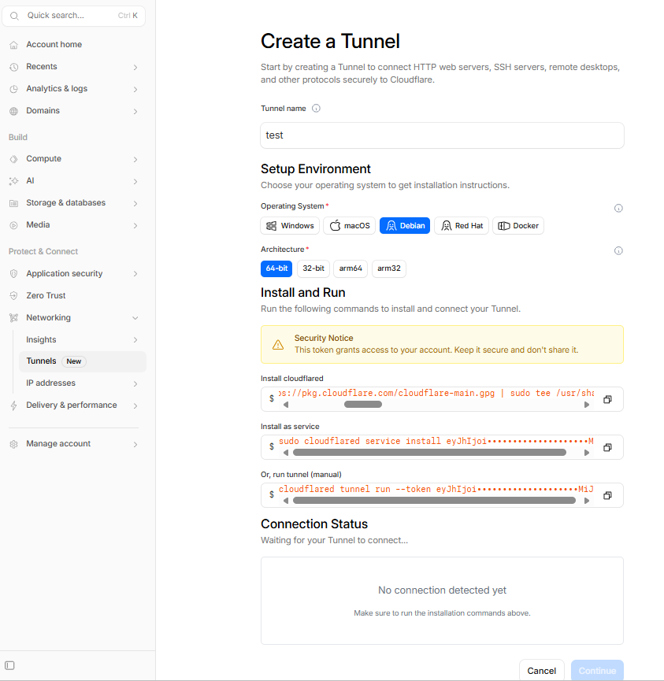
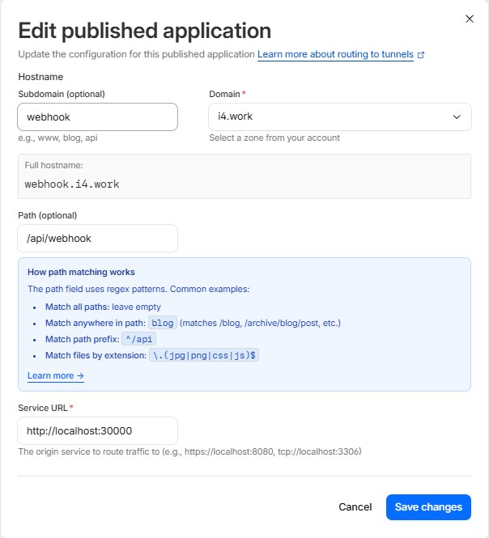
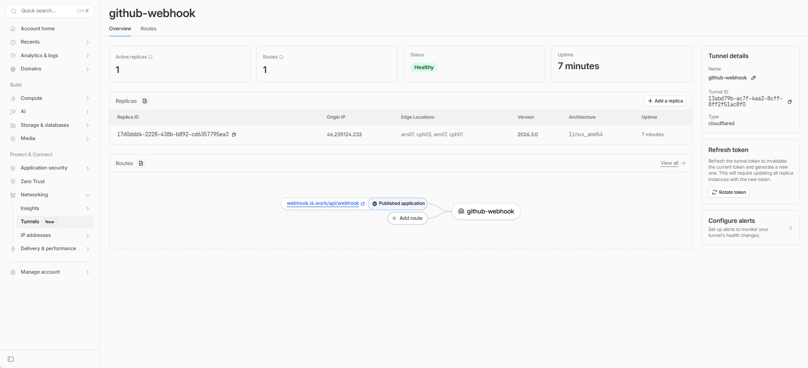

# 本地 Webhook 设置

语言：[English](LOCAL_WEBHOOK_SETUP.md) | 中文

本文是 [LOCAL_WEBHOOK_SETUP.md](LOCAL_WEBHOOK_SETUP.md) 的中文译文。英文版是权威版本；如果两者不一致，以英文版为准。

## 什么是 webhook

webhook 可以理解成“事件发生后，对方向你预留的地址发一个 HTTP 请求”。

在这个项目里：

- GitHub 是事件源
- 你的 `sec-review-bot` 服务是接收方
- 你需要给 GitHub 一个可访问的 webhook URL
- 当 issue / PR 事件发生后，GitHub 会把 payload 发到这个 URL

这和“你去轮询 GitHub”不一样，而是 GitHub 主动把事件推给你。

## Webhook 和 API 权限

本地 webhook 设置只解决“收事件”这件事。一个能工作的 GitHub App 还需要 API 权限，才能在收到事件后继续回写 GitHub。

- Webhook 决定 App 能收到哪些 GitHub 事件。
- GitHub API 权限决定 App 后续能做什么，例如发 comment、创建 review、开 draft PR。

这个项目里的服务端会：

1. 验证 webhook secret
2. 解析 GitHub 发来的事件 payload
3. 通过 App 身份去请求 GitHub API

## 为什么本地开发不能直接填 `localhost`

GitHub 的服务器无法直接访问你本机的 `localhost:30000`。

因此在本地开发时，你需要一个“GitHub 能访问到的公网 HTTPS 地址”，再把这个地址转发到你的本地 webhook 服务：

```text
GitHub -> 公网 HTTPS URL -> 本地 http://localhost:30000/api/webhook
```

常见选择有两种：

- `smee`
  - 快速、轻量，适合本地调试
- Cloudflare Tunnel
  - 更正式，适合你已经有域名或希望固定一个稳定 webhook 地址

## 本地 webhook 地址

App receiver 默认监听：

```text
http://localhost:30000/api/webhook
```

其中：

- 端口来自 `PORT`
- 路径是 `/api/webhook`

## 方案一：使用 `smee`

很多 GitHub App / webhook 教程都会使用 [`smee.io`](https://smee.io/)，因为它很适合“先把链路打通”的本地开发场景。

### 怎么工作

1. 在 `smee.io` 获取一个临时公网 URL
2. GitHub 把 webhook 发到这个公网 URL
3. 本地运行 `smee` 客户端，把事件转发到你的本地服务

### 命令

```bash
npx smee -u https://smee.io/xxxxxxxxxxxx -t http://localhost:30000/api/webhook
```

其中：

- `-u`: 你的公网 `smee` channel 地址
- `-t`: 本地 webhook 服务地址

### 适合场景

- 本地快速调试 webhook
- 临时验证 GitHub App 配置
- 不想自己处理证书、反向代理、入站端口和域名

### 代价

- URL 往往更像临时调试地址
- 更适合开发态，不太适合作为正式 webhook 地址

## 方案二：使用 Cloudflare Tunnel

如果你已经有域名，但没有现成的公网入站服务，或者不想自己处理端口转发、TLS 证书和公开暴露本机端口，也可以使用 Cloudflare Tunnel。

### 怎么工作

1. 在一台可运行 `cloudflared` 的机器上创建 tunnel
2. 把某个域名或子域名路由到本地 webhook 服务
3. GitHub 直接把 webhook 发到这个稳定的 HTTPS 地址

例如把：

```text
https://your-subdomain.example.com
```

路由到：

```text
http://localhost:30000/api/webhook
```

### 图示

创建的时候就跟随指令：







卸载的时候可以看：<https://developers.cloudflare.com/tunnel/troubleshooting/>，命令是：

```bash
sudo cloudflared service uninstall
```

### 适合场景

- 想要稳定、正式、可长期复用的 webhook URL
- 已经有 Cloudflare 和域名
- 不想自己维护 nginx、证书和公网端口暴露

## 与 GitHub App 权限相关的常见坑

- 你改了 App 权限，但 installation 还没重新批准
- webhook secret 和本地配置不一致
- webhook URL 填对了，但本地转发工具没在跑
- 你以为自己在监听公网地址，其实本地服务没有监听对应端口
- App 没有 `Pull requests`、`Issues` 或 `Contents` 的足够权限，导致后续回写失败

常见 GitHub API 报错是：

```text
403 Resource not accessible by integration
```

这通常意味着权限不够或 installation 还没更新。

## 参考

- GitHub App quickstart:
  - <https://docs.github.com/en/apps/creating-github-apps/writing-code-for-a-github-app/quickstart>
- GitHub webhook guide:
  - <https://docs.github.com/en/apps/creating-github-apps/writing-code-for-a-github-app/building-a-github-app-that-responds-to-webhook-events>
