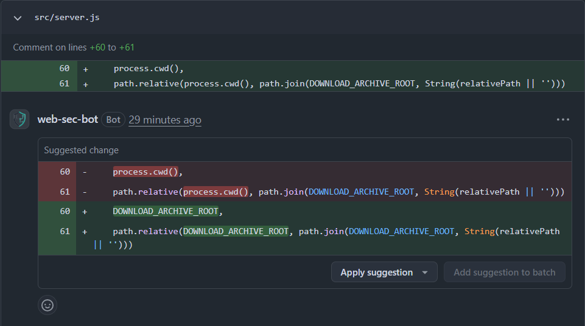

# Suggestion Comment Design

语言：[English](SUGGESTION_COMMENT_DESIGN.md) | 中文

本文是 [SUGGESTION_COMMENT_DESIGN.md](SUGGESTION_COMMENT_DESIGN.md) 的中文译文。英文版是权威版本；如果两者不一致，以英文版为准。

## Goal

把 patch diff 映射成 GitHub PR review suggestions，让 reviewer 可以直接在 PR UI 中应用一个聚焦的修复。例如：



Suggestion reviews 是这里唯一能让 reviewer 从 PR diff 中直接应用 proposed mitigation 的 GitHub 发布面。普通 summary comment 可以解释问题，standalone patch 可以描述编辑，但它们都不能在 changed lines 上提供 anchored apply button。

Sources:

- GitHub REST API, "Create a review for a pull request": <https://docs.github.com/en/rest/pulls/reviews#create-a-review-for-a-pull-request>
- GitHub REST API, "Create a review comment for a pull request": <https://docs.github.com/en/rest/pulls/comments>
- GitHub Docs, "Reviewing proposed changes in a pull request": <https://docs.github.com/pull-requests/collaborating-with-pull-requests/reviewing-changes-in-pull-requests/reviewing-proposed-changes-in-a-pull-request>

## Hard Guardrail

GitHub suggestions 是 PR-diff-anchored review comments，不是 generic patch transport channel。

GitHub 要求每个 inline suggestion：

- target 一个已经存在于 PR changed-file set 中的文件。
- anchor 到 PR diff 中可见的 line interval。

因此，这个 workflow 只为 mitigation patch 中能映射到这些 PR-visible lines 的部分发 suggestions。PR diff 外的 mitigation edits 可以继续保留在 mitigation diff 中，但会 fallback 到标准 summary path，而不是被强行塞进 inline suggestions。

## Implementation

### Eligibility Rules

当存在 mitigation patch，且至少一个 patch hunk 可以 anchor 到 PR-visible diff hunk 时，emit suggestion candidates。

每个 candidate 的必需条件：

1. Patch file 存在于 PR changed-file set 中，并且有 PR patch content。
2. Patch hunk 有非空 suggestion replacement content。
3. Patch hunk 可以 anchor 到 right-side（current-version）PR diff interval。

这是 partial-admission pipeline：

- non-anchorable files/hunks 会被跳过，anchorable ones 仍会被 emit。
- skipped entries 会在 suggestion manifest 的 `unmapped_changes` 中报告。

### Mapping Pipeline

#### 1. Parse the mitigation diff

解析 unified diff content，并按文件收集：

- `path`
- hunk header (`old_start`, `old_count`, `new_start`, `new_count`)
- hunk lines

#### 2. Restrict to PR-visible files

只保留能匹配 `pulls.listFiles` entries 的 patch files；`pulls.listFiles` 是 GitHub API 中 PR changed-file metadata 和 visible patch hunks 的来源。

#### 3. Build suggestion replacements and bodies

对每个 eligible patch hunk：

- 从 non-removed hunk lines 构造 replacement text。
- 构造 suggestion body：short mitigation summary，然后是 literal ```` ```suggestion ```` fence、replacement lines，以及 closing ```` ``` ```` fence。

#### 4. Build review anchors from overlapping PR patch hunks

对每个 patch hunk，在同一文件中找到 overlapping PR patch hunk，并派生 right-side anchors：

- `start_line = new_start`
- `line = new_start + new_count - 1`
- `side = RIGHT`

如果 `start_line === line`，提交 single-line anchor。如果 `start_line < line`，提交带 `start_line` 和 `start_side` 的 multi-line anchor。

#### 5. Publish one review with all inline suggestions

创建一个 PR review，包含：

- inline suggestion comments (`path`, `body`, `line`, `side`, optional `start_line`, `start_side`)
- `commit_id = head_sha`

### Fallback Behavior

当没有 candidate 被 emit：

1. 不发布 inline suggestions。
2. 发布标准 top-level PR summary comment。

这样可以保持 deterministic behavior，并避免 weakly anchored 或 misleading inline edits。

当部分 candidates 被 emit，但部分 hunks 不可 anchor：

1. 为 anchorable candidates 发布 inline suggestions。
2. 在 review body 中追加 `Unmapped Mitigation Changes` section，说明 non-anchorable hunks。
