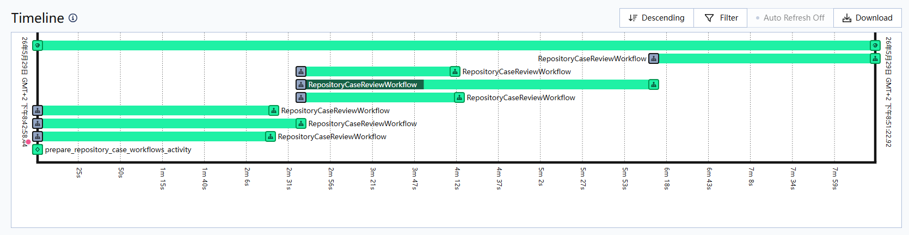
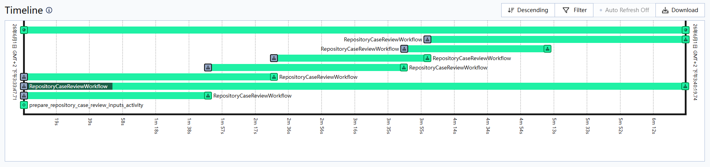
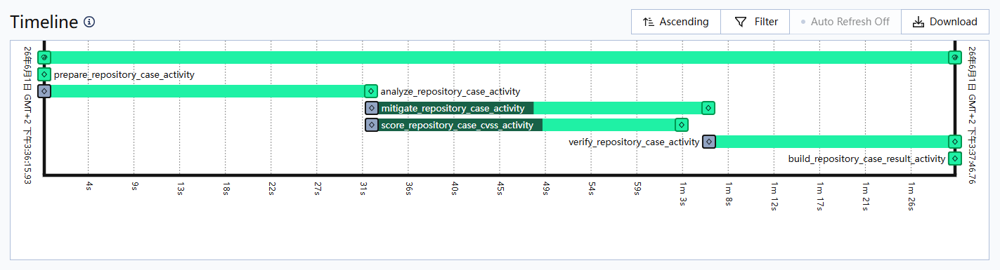

# Repository Review Concurrency and Failure Boundaries

Language: English | [中文](CONCURRENCY_AND_FAILURES.zh.md)

This document explains how `repository-review` uses in-stage concurrency, which knobs affect wall time, and how failures are bounded.

For system-wide concurrency between app-submitted runs, workflow fanout, and worker
activity capacity, see
[../CONCURRENCY_MODEL.md](../CONCURRENCY_MODEL.md). This document focuses on the
repository review workflow after one repository run has been admitted.

## Overview

`repository-review` has several places where work can run concurrently:

- discovery can process chunks concurrently.
- triage can process batch drafts concurrently.
- case processing can process cases concurrently.
- within one case, CVSS scoring can overlap with the mitigation / verification path.
- delivery planning can process batch drafts concurrently.
- delivery execution can process combined deliveries concurrently.

## Sliding Windows

The in-stage repository review concurrency discussed in this document uses sliding windows.

Sliding-window concurrency means the system keeps at most N tasks in flight. Whenever one task finishes, the next task starts.

```text
start up to N tasks
one task finishes
start the next queued task
repeat until the queue is empty
```

This is different from fixed batches, where the system waits for a whole batch to finish before starting the next batch. Sliding windows reduce idle time when tasks have uneven duration.

The two case workflow timelines below both use concurrency `3`, but they schedule work differently. Fixed batches wait for a whole group to finish before starting the next group:

> *Timeline screenshots in this section are for scheduling-shape and execution-order reference only; workflow and activity labels may come from older runs and are not the current API names.*



With sliding windows, completed slots are filled immediately instead of waiting for the whole group:



*Read the left edge of each case bar as its start time. The long bars are cases that simply take longer to run; later cases still start as soon as other slots finish.*

## Stage Details

### Discovery

Discovery splits repository files into chunks. Temporal and direct paths both execute discovery chunks with a sliding window.

The concurrency limit comes from `AGENT_DISCOVERY_MAX_CONCURRENCY`. The default is `1`. Effective concurrency never exceeds the number of chunks.

In the Temporal path, each discovery chunk is an activity and uses Temporal activity retry. If a chunk still fails after retry, the whole discovery fails. Discovery does not produce a partial completed result because missing a chunk means scan coverage is incomplete.

### Triage

Triage runs inside one activity. Batched triage executes batch drafts with a sliding window, then enters global refinement / workbench state.

The current batch draft concurrency limit is the code constant `TRIAGE_MAX_BATCH_CONCURRENCY = 3`. This is not a normal deployment environment variable. Triage produces a global case set, so a failed batch fails the whole triage stage.

### Case Processing

After triage, each case is an independent review unit. Repository review executes case workflows with a sliding window.

The concurrency limit comes from `AGENT_CASE_PROCESSING_MAX_CONCURRENCY`. The default is `1`. Effective concurrency never exceeds the number of cases.

One case also has internal parallelism. In Temporal, CVSS scoring can run while the mitigation / verification path continues:



If a case still fails after activity retry, repository review records a blocked case result and other cases continue.

### Delivery Planning

Delivery planning can execute batch drafts with a sliding window, then enters global refinement / workbench state.

The current batch draft concurrency limit is the code constant `DELIVERY_PLANNING_MAX_BATCH_CONCURRENCY = 3`. This is not a normal deployment environment variable. Delivery planning produces a global delivery plan, so a failed batch fails the whole delivery planning stage.

### Delivery Execution

Delivery execution only consumes cases with `disposition == "keep"`.

`single` delivery does not call an agent and does not enter the patch synthesis concurrency pool. It directly projects case-level `review_record.mitigation.file_changes`.

`combined` delivery calls the patch-synthesis agent. Multiple combined deliveries execute with a sliding window.

The concurrency limit comes from `REPOSITORY_PATCH_SYNTHESIS_MAX_CONCURRENCY`. The default is `4`.

In the Temporal path, combined delivery patch synthesis is an independent activity. `single` delivery remains a lightweight projection and does not occupy the patch synthesis window. The direct path still executes locally with a sliding window.

If one combined delivery patch synthesis fails, other deliveries continue. Public `deliveries[]` only contains successful deliveries. Check run logs for failed synthesis debugging.

## Tuning Order

Usually the first knob to tune is `AGENT_CASE_PROCESSING_MAX_CONCURRENCY`. Case processing usually occupies the longest wall-clock window, and analyzer / mitigator / verifier work can be LLM-heavy or sandbox-heavy.

The second common knob is `REPOSITORY_PATCH_SYNTHESIS_MAX_CONCURRENCY`. It only affects `combined` delivery patch synthesis. It does not change delivery boundaries or merge different deliveries into one final patch.

Discovery tuning depends on chunk count and per-chunk cost. If a repository produces only one chunk, raising `AGENT_DISCOVERY_MAX_CONCURRENCY` does nothing. If there are many chunks, raising discovery concurrency can reduce discovery wall time.

Temporal deployments also have a worker-side activity executor pool: `TEMPORAL_ACTIVITY_WORKERS`. The workflow concurrency settings above control how many tasks the workflow is allowed to keep in flight. `TEMPORAL_ACTIVITY_WORKERS` controls how many activities a worker can execute at once. If this pool is too small, activities that the workflow has already scheduled still queue on the worker side.

## Resource Limits

Higher concurrency can hit local resource limits first. Running too many analyzer / mitigator / verifier containers at once can saturate CPU, memory, network, or disk IO.

LLM provider limits also become more visible, such as TPM, RPM, or burst concurrency limits.

Concurrency is not the same as TPM. TPM depends on token rate over time, which depends on task type, request frequency, token size per request, and agent behavior.

Both situations can happen:

- high concurrency with sparse, low-token requests, where TPM stays modest
- low concurrency with large contexts and many consecutive turns, where TPM is exhausted quickly

Set concurrency from workload shape and measurements, not intuition alone.

Common ways to raise the ceiling:

- more local CPU / memory / IO
- higher total LLM budget
- higher-TPM / higher-RPM LLM APIs
- multiple LLM API sources sharing load
- a larger Temporal activity worker pool

## Example Measurements

The following approximate measurements show the effect of case processing concurrency in one repository review run.

| Run | Case Concurrency | Total Duration | Discovery | Triage | Case Processing | Delivery Planning | Patch Synthesis |
| --- | ---: | ---: | ---: | ---: | ---: | ---: | ---: |
| A | 3 | 49m46.8s | 0m42s, about 1.4% | 4m30s, about 9.0% | about 32m44s, about 65.8% | 2m29s, about 5.0% | about 9m20s, about 18.8% |
| B | 6 | 31m21s | 5m46s, about 18.4% | 4m33s, about 14.5% | about 15m10s, about 48.7% | 2m38s, about 8.4% | about 3m12s, about 10.2% |
| C | 8 | 32m19s | 1m58s, about 6.1% | 3m23s, about 10.5% | about 18m51s, about 58.3% | 3m13s, about 9.9% | about 4m54s, about 15.2% |

- Increasing case concurrency from `3` to `6` significantly reduced total duration. The main change was that case processing shrank.
- Increasing case concurrency from `6` to `8` did not reduce total duration further. It increased from **31m21s** to **32m19s**, about **58 seconds** longer. In this workload, raising case concurrency further had no clear benefit; the system was increasingly shaped by single-case tail latency, stage variance, and other resource bottlenecks.
